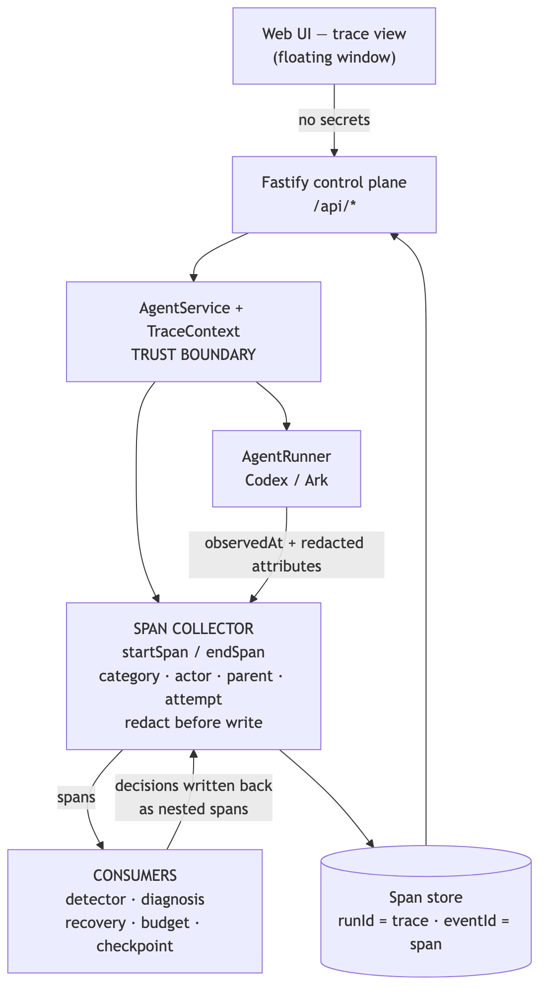

# AgentGuard

Volc Agent Launchpad is a hackathon-built Agent platform whose real product is
**AgentGuard**, the reliability middleware wrapped around it. AgentGuard turns
every Agent Run into a Glass Box: a single-root span tree that captures what the
Agent did, why it failed, and how it recovered, with no synthetic telemetry.

Every span carries a **category**, **actor**, **parent**, **attempt index**, and a
**duration with its measurement source**. On top of that tree, AgentGuard runs
deterministic failure detection, diagnosis, checkpointed recovery, and proactive
budget control, each writing its decisions back as spans nested under the step
that triggered them. The result is observability that drives recovery instead of
sitting beside it.

The middleware is demonstrated on a minimal platform: Agent CRUD, a browser
Playground, persistent workspaces, and Codex CLI backed by the Volcengine Ark
Responses API. See the [AgentGuard PRD](docs/AgentGuard%20PRD.md) and
[AgentGuard TRD](docs/AgentGuard%20TRD.md).

> [!WARNING]
> This is a single-user proof of concept. Do not use production data or
> credentials.

## Features

AgentGuard features:

- **Glass Box span tree** — every Run is a single-root, nested span tree with category, actor, parent, attempt index, and qualified durations
- **Redaction** — configured Ark / auth credentials are scrubbed before persistence
- **Real runner instrumentation** — Codex JSONL items become model/tool spans with real exit codes; `runtime_crash` performs a real container kill
- **Closed-loop recovery** — failure detection, deterministic diagnosis, checkpointed retry / restart-resume, and `RECOVERY_VERIFIED`, all nested under the failing span
- **Proactive budget control** — tiered pre-turn wrap/gate, mid-turn projection cancel, and compress-on-recovery (soft automatic, hard HITL)
- **Trace UI** — run list, filter chips that preserve hierarchy, expandable span detail, and JSON evidence export
- **LLM Wiki** — every created Agent can scaffold and maintain `wiki/` on large tasks, delegating upkeep to a `@wikier` subagent

## Snapshots


## Setup

Requirements:

- Node.js 22+, npm 10+
- Docker, Colima, or Podman (only one is required)
- A Volcengine Ark API key and endpoint that supports the Responses API

Codex CLI is included in the Runtime image and is not required on the host.

Verify the local tools:

```bash
node --version
npm --version
docker --version        # Docker Desktop, Docker Engine, or Colima
podman --version        # Use this instead when running Podman
```

Clone the repository and start the POC:

```bash
git clone <repository-url> volc-agent-launchpad
cd volc-agent-launchpad
ARK_API_KEY=your-ark-api-key \
ARK_MODEL=ep-your-endpoint-id \
npm run poc
```

The first run installs Node.js dependencies and builds the Runtime image. The
script automatically selects Docker, Colima, or Podman; force Podman with
`CONTAINER_ENGINE=podman`.

Open <http://localhost:3000>, select **Create Agent**, enter a name, description,
and workspace instructions, then enter a task in the Playground, for example:

```text
Create a TypeScript hello-world CLI, add a test, and run it.
```

The Agent can write files, run commands, and continue the same Codex session in
later messages.

Press `Ctrl+C` to stop. The script removes temporary Runtime containers but keeps
Agent workspaces and conversations; run the same command to resume later.

For Docker Compose, development, and ECS deployment, see
[docs/LOCAL_POC.md](docs/LOCAL_POC.md), [docs/DEPLOYMENT.md](docs/DEPLOYMENT.md),
and the configuration table in [.env.example](.env.example).

## Problem

A Run is a tree of model calls, tool calls, and policy decisions, but the
platform stored it as a flat list. Failing steps were unlocatable, retries
unattributable, and observability sat beside recovery instead of driving it.

## Rationale

The trace is a sensor, not a dashboard. Deterministic policies read spans and
write their decisions back as nested spans under the step that triggered them, so
diagnosis, recovery, and verification are evidence in the same tree.

## Design summary

Every span carries a **category**, **actor**, **parent**, **attempt index**, and a
**duration with its measurement source**. `runId` is the trace id; `eventId` is
the span id.

- **Span collector** — `startSpan` / `endSpan`, assign taxonomy, redact before
  persist
- **Tree builder** — reconstruct a single-root tree (`RUN_STARTED`) from the
  stored list
- **Item extractor** — Codex JSONL items become model/tool spans with real exit
  codes
- **Consumers** — detector, diagnosis, recovery, and budget read the stream and
  nest their decisions under the triggering span

Architecture: [docs/agentguard-architecture.md](docs/agentguard-architecture.md)



## Automated tests

```bash
npm run check
```

Runs typecheck, server and web unit/integration tests, and both production
builds. AgentGuard tests live under `apps/server/src/agentguard/`. The redaction
evidence test (`redaction-evidence.test.ts`) serializes a completed run that
leaked `ARK_API_KEY` into command, output, and error text and asserts the secret
never appears.

## Demo steps

The beats:

1. **Start the POC** and create or select an Agent.
2. **Run a real task** in the Playground. The AgentGuard window auto-opens on the
   active run.
3. **Show the span tree** in the **Trace** tab: measured `TURN` spans with
   per-turn token usage, nested `MODEL_CALL` / `TOOL_CALL` spans with commands and
   real exit codes, actor badges, and redacted attributes; apply the errors-only
   filter and confirm the tree stays nested.
4. **Inject a real failure** — kill the runtime container via
   **Inject failure → runtime_crash**; the tool span turns red on its own, no
   synthetic event.
5. **Detection and recovery** — `INCIDENT_OPENED`, `DIAGNOSIS_ISSUED`,
   `RECOVERY_STARTED`, and `CHECKPOINT_RESTORED` nest under the failing span; the
   next `TURN` carries `RECOVERY_VERIFIED`; `attemptIndex` marks the redone work.
6. **Audit and export** — open the **Runs** tab, export the trace as JSON, confirm
   no secret material appears; send a follow-up message to prove the session and
   workspace resumed.
7. **LLM Wiki** — on a large task the Agent scaffolds and maintains
   `wiki/` in its workspace (index, log, architecture pages) and delegates upkeep
   to the `@wikier` subagent.

## Limitations

- Single-node JSON persistence; not multi-tenant or HA.
- No recovery across control-plane process restart.
- Alerts are UI-only.
- Classification covers a fixed failure taxonomy, not arbitrary faults.
- Checkpoints are best-effort file copies, not transactional filesystem snapshots.
- Trace/span IDs are mapped from `runId`/`eventId` rather than OpenTelemetry
  exporters.
- Mid-turn budget projection is heuristic; it can false-positive or false-negative
  vs true Ark usage.
- Soft compress does not shrink the underlying Codex thread history; it only wraps
  the next user prompt.
- **Model and tool span durations are inter-item deltas, not measured spans**,
  because Codex reports only item completion. Durations marked `measured` (turn,
  recovery, checkpoint) are the load-bearing numbers.
- The audit trail is not tamper-evident. Hash chaining and signed exports were
  deliberately cut.
- **`runtime_crash` performs a real container kill** (`docker kill` /
  force-remove) when the container runner is active, so the resulting span carries
  a genuine non-zero exit. The local process runner falls back to simulated
  injection.
