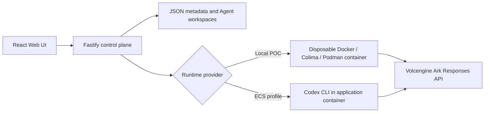

# Volc Agent Launchpad

A minimal Agent platform for three-day middleware hackathons. It provides Agent
CRUD, a browser Playground, persistent workspaces, and Codex CLI backed by the
Volcengine Ark Responses API.

**Middleware story: AgentGuard** — team-designed reliability middleware
(structured observability + deterministic failure recovery). See
[AgentGuard PRD](docs/AgentGuard%20PRD.md) and
[AgentGuard TRD](docs/AgentGuard%20TRD.md).

Run it locally with Docker, Colima, or rootless Podman, or deploy it to
Volcengine ECS.

> [!WARNING]
> This is a single-user proof of concept. Do not use production data or
> credentials. See [SECURITY.md](SECURITY.md).

## Screenshots

### Agent Playground


### Create an Agent


## Features

- React and TypeScript Web UI
- Agent create, edit, start, stop, delete, and multi-turn chat
- Fastify control plane with asynchronous Run state
- Persistent Agent workspaces and Codex sessions
- Disposable Docker, Colima, or Podman container for each local turn
- Docker and Terraform deployment paths for Volcengine ECS
- **AgentGuard:** Glass Box span tree (category, actor, parent, attempt, qualified duration), incidents, checkpoints, token budget + HITL approval, real container-kill crash injection, and policy-driven retry / restart-resume

## AgentGuard — Glass Box (trace and audit)

**Track: Glass Box — trace and audit.**

### What we've built

AgentGuard is implemented end to end across the control plane, Runtime, data,
and UI, exactly along the brief's "Trace, Audit, and Observability" middleware
direction:

- **Span tree, not a log stream** — every `TraceEvent` is a span with `category`,
  `actor`, `parentEventId`, `attemptIndex`, and a duration that records its
  measurement source. `runId` is the trace id; `eventId` is the span id. No
  synthetic telemetry: per-turn coverage comes from the measured `TURN` span.
- **Redaction before persistence** — configured Ark / API-auth credential values
  are registered before store init and scrubbed by literal value on top of
  pattern matching; previews redact before truncation. Asserted by
  `redaction-evidence.test.ts`.
- **Real runner instrumentation** — Codex JSONL items become model/tool spans
  with real exit codes; non-zero command exits turn spans red organically.
- **Queryable trace API** — `GET /api/runs` (newest-first, per-run summaries)
  and `GET /api/runs/:id/events` with category / actor / status / since filters,
  `tree=true`, and JSON evidence export; unknown runs return 404.
- **Trace UI** — run list tab, nested span tree with actor badges and qualified
  durations, expandable span detail, filter chips that preserve hierarchy, and
  one-click jump to the failing step.
- **Closed-loop recovery** — failure detection, deterministic diagnosis,
  checkpointed retry / restart-resume, and `RECOVERY_VERIFIED` all nest as
  children of the failing span; `runtime_crash` performs a real container kill
  so the error span carries a genuine exit code.
- **Proactive budget control** — tiered pre-turn prompt wrap/gate, mid-turn
  projection cancel driven by accumulated span data, deterministic
  compress-on-recovery (soft automatic, hard HITL), and persisted global
  policy settings (`GET/PATCH /api/agentguard/settings`).

### Problem

A Run is a tree of model calls, tool calls, and policy decisions, but the platform stored it as a flat list. Failing steps were unlocatable, retries unattributable, and observability sat beside recovery instead of driving it.

### Rationale

The trace is a sensor, not a dashboard. Deterministic policies read spans and write their decisions back as nested spans under the step that triggered them, so diagnosis, recovery, and verification are evidence in the same tree.

### Design summary

Every span carries a **category**, **actor**, **parent**, **attempt index**, and a **duration with its measurement source**. `runId` is the trace id; `eventId` is the span id.

- **Span collector** — `startSpan` / `endSpan`, assign taxonomy, redact before persist
- **Tree builder** — reconstruct a single-root tree (`RUN_STARTED`) from the stored list
- **Item extractor** — Codex JSONL items become model/tool spans with real exit codes
- **Consumers** — detector, diagnosis, recovery, and budget read the stream and nest their decisions under the triggering span

Architecture: [docs/agentguard-architecture.md](docs/agentguard-architecture.md)


### Tests

```bash
npm run check
```

Includes AgentGuard unit and integration tests under `apps/server/src/agentguard/`. The redaction evidence test (`redaction-evidence.test.ts`) serializes a completed run that leaked `ARK_API_KEY` into command, output, and error text and asserts the secret never appears.

### Limitations

- Single-node JSON persistence; not multi-tenant or HA.
- No recovery across control-plane process restart.
- Alerts are UI-only.
- Classification covers a fixed failure taxonomy, not arbitrary faults.
- Checkpoints are best-effort file copies, not transactional filesystem snapshots.
- Not a replacement for production APM or distributed tracing.
- Trace/span IDs are mapped from `runId`/`eventId` rather than OpenTelemetry exporters.
- Mid-turn budget projection is heuristic; it can false-positive or false-negative vs true Ark usage.
- Soft compress does not shrink the underlying Codex thread history; it only wraps the next user prompt.
- **Model and tool span durations are inter-item deltas, not measured spans**, because Codex reports only item completion. Durations marked `measured` (turn, recovery, checkpoint) are the load-bearing numbers.
- **Byte-based budget projection is weak.** `streamBytes` is derived from redacted metadata previews capped at 200 characters, so the byte term contributes little; projection is effectively driven by span counts.
- The span tree has no search, virtualization, or retention policy; it is sized for hackathon-scale runs.
- The audit trail is not tamper-evident. Hash chaining and signed exports were deliberately cut.
- **`runtime_crash` performs a real container kill** (`docker kill` / force-remove) when the container runner is active, so the resulting span carries a genuine non-zero exit. The local process runner falls back to simulated injection.

## Requirements

- Node.js 22+
- npm 10+
- Docker, Colima, or Podman
- A Volcengine Ark API key and endpoint that supports the Responses API

Codex CLI is included in the Runtime image and is not required on the host.

## Local browser SOP

### 1. Check the local tools

Install Node.js 22+ and one supported container engine, then verify them:

```bash
node --version
npm --version
docker --version        # Docker Desktop, Docker Engine, or Colima
podman --version        # Use this instead when running Podman
```

Only one container engine is required. Codex CLI is already included in the
Runtime image.

### 2. Clone the repository

```bash
git clone <repository-url> volc-agent-launchpad
cd volc-agent-launchpad
```

Skip this step when already working from the repository root.

### 3. Start the POC

```bash
ARK_API_KEY=your-ark-api-key \
ARK_MODEL=ep-your-endpoint-id \
npm run poc
```

The first run installs Node.js dependencies and builds the Runtime image. The
script automatically selects Docker, Colima, or Podman.

### 4. Open the browser

Visit <http://localhost:3000>, or open it from the terminal:

```bash
open http://localhost:3000       # macOS
xdg-open http://localhost:3000   # Linux desktop
```

In the Web UI:

1. Select **Create Agent**.
2. Enter a name, description, and workspace instructions.
3. Select **Create Agent** again.
4. Enter a task in the Playground, for example:

   ```text
   Create a TypeScript hello-world CLI, add a test, and run it.
   ```

The Agent can write files, run commands, and continue the same Codex session in
later messages.

### 5. Stop and resume

Press `Ctrl+C` in the startup terminal. The script removes temporary Runtime
containers but keeps Agent workspaces and conversations.

- macOS state: `~/.volc-agent-launchpad/`
- Linux state: `.local/`
- Custom location: set `LOCAL_POC_DATA_ROOT`

Run the same `npm run poc` command to continue later.

### Select a specific container engine

Force Podman when multiple engines are installed:

```bash
CONTAINER_ENGINE=podman \
ARK_API_KEY=your-ark-api-key \
ARK_MODEL=ep-your-endpoint-id \
npm run poc
```

Colima uses `CONTAINER_ENGINE=docker` because it exposes the Docker CLI.

For a clean Linux host, follow the
[rootless Podman setup](docs/LOCAL_POC.md#rootless-podman-on-linux).

## Docker Compose

Create and edit the configuration:

```bash
./scripts/bootstrap-local.sh
```

Required values in `.env`:

```dotenv
ARK_API_KEY=your-ark-api-key
ARK_MODEL=ep-your-endpoint-id
APP_AUTH_TOKEN=replace-with-at-least-24-random-characters
```

Start the application:

```bash
docker compose up --build
```

Open <http://localhost:3000>. Stop it without deleting Agent data:

```bash
docker compose down
```

## Development

```bash
npm install
cp .env.example .env
npm install --global @openai/codex@0.111.0
npm run dev
```

- Web UI: <http://localhost:5173>
- API: <http://localhost:3000>

Use local paths in `.env` when running outside Docker:

```dotenv
APP_DATA_DIR=.data
AGENT_WORKSPACE_ROOT=workspaces
CODEX_HOME=codex-home
```

## Deployment

- [Existing Linux ECS with Docker](docs/DEPLOYMENT.md#existing-linux-ecs)
- [Complete Volcengine environment with Terraform](docs/DEPLOYMENT.md#terraform-deployment)
- [Local Docker, Colima, and Podman details](docs/LOCAL_POC.md)

The existing-ECS script deploys from the current source tree:

```bash
cp .env.example .env.production
./scripts/deploy-existing-ecs.sh .env.production
```

The Terraform path provisions VPC, subnet, security group, ECS, and EIP:

```bash
cp deploy/volcengine/terraform.tfvars.example \
  deploy/volcengine/terraform.tfvars
./scripts/deploy-volcengine.sh
```

## Configuration

| Variable | Default | Purpose |
| --- | --- | --- |
| `ARK_API_KEY` | Required | Ark model API key. |
| `ARK_MODEL` | Required | Responses-capable endpoint or model ID. |
| `ARK_BASE_URL` | Beijing v3 endpoint | Ark OpenAI-compatible API URL. |
| `APP_AUTH_TOKEN` | Empty on loopback | Shared demo token; use 24+ random characters remotely. |
| `RUNTIME_PROVIDER` | `local-process` | `container` for disposable local Runtime containers. |
| `CODEX_SANDBOX_MODE` | `workspace-write` | Codex inner sandbox mode. |
| `CODEX_TIMEOUT_MS` | `600000` | Maximum duration of one turn. |
| `LOCAL_POC_DATA_ROOT` | Platform-specific | Local metadata, workspace, and session directory. |

See [.env.example](.env.example) for all Runtime and resource-limit options.

## How it works



The first turn uses `codex exec`; later turns resume the stored Codex thread.
Deleting an Agent archives its workspace under `workspaces/.deleted/`.

See [docs/ARCHITECTURE.md](docs/ARCHITECTURE.md) for component and extension
boundaries.

## Validation

```bash
npm run check
terraform fmt -check -recursive deploy/volcengine
docker compose config
```

## Documentation

- [AgentGuard PRD](docs/AgentGuard%20PRD.md)
- [AgentGuard TRD](docs/AgentGuard%20TRD.md)
- [TechJam official brief](docs/TechJam_Info.md)
- [Architecture](docs/ARCHITECTURE.md)
- [Local POC](docs/LOCAL_POC.md)
- [Deployment](docs/DEPLOYMENT.md)
- [Hackathon extension guide](docs/HACKATHON_EXTENSION_GUIDE.md)
- [Security policy](SECURITY.md)
- [Contributing](CONTRIBUTING.md)

## License

[MIT](LICENSE)
