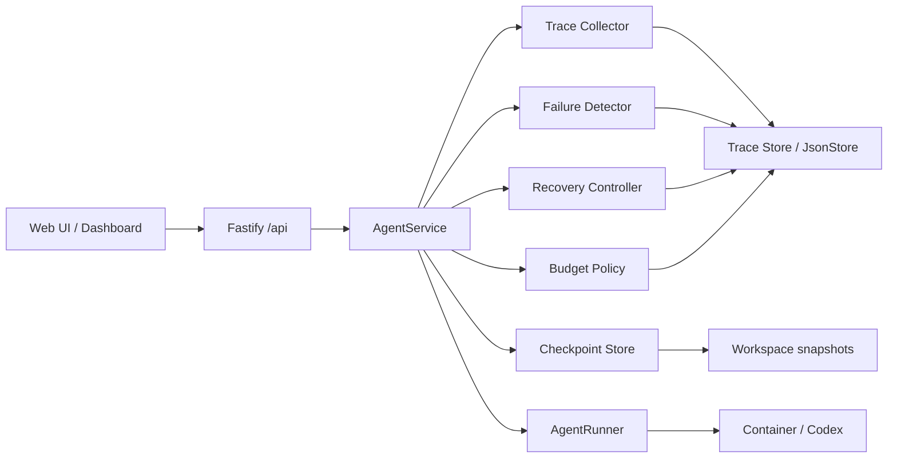
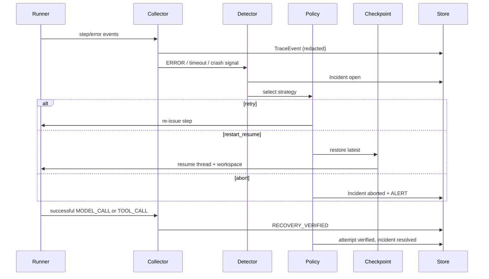
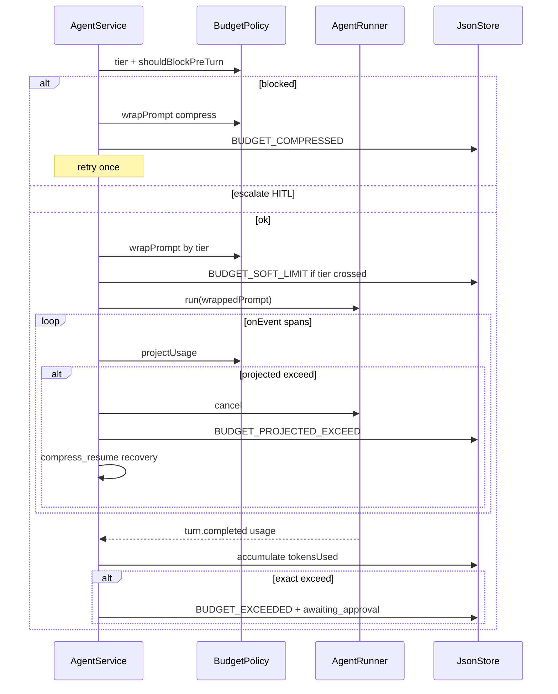

# Technical Requirements Document: AgentGuard

## 1. System Overview and Architectural Thesis

AgentGuard is a deterministic **span-based tracing** layer around the Volc Agent Launchpad runtime. A Run is represented as a tree of spans, each carrying a category, an actor, a parent, an attempt index, a duration with a recorded measurement source, and redacted attributes. Failure detection, deterministic recovery, checkpointing, and `BudgetPolicy` are **consumers** of that span stream: they read spans to decide, and they write their decisions back as spans nested under the span that triggered them.

**Track:** **Glass Box — trace and audit.** The trace is the product. Recovery and budget control exist to demonstrate that the trace is precise enough to drive automated control, which is the distinguishing claim versus a dashboard. Product requirements: [AgentGuard PRD](./AgentGuard%20PRD.md). Technical design of record: [Glass Box span model design](./superpowers/specs/2026-08-27-glass-box-span-model-design.md).

**Design invariants.**

1. Every span has non-null `category`, `actor`, and `attemptIndex`.
2. The parent chain is acyclic and roots at the run span.
3. The middleware never fabricates a span it did not observe or perform.
4. `durationMs` is either measured, derived with `durationSource` recorded, or legitimately null for point-in-time events.
5. Redaction happens before persistence, never only before display.



## 2. Integration Points and Starter Seams

| Seam | File(s) | AgentGuard change |
| --- | --- | --- |
| Fastify routes | `apps/server/src/app.ts` | Events, incidents, recoveries, diagnoses, checkpoints, settings, fail-injection under `/api`; **run list; span query filters; `tree=true`** |
| AgentService | `apps/server/src/agent-service.ts` | Own `TraceContext`; open/close `TURN` spans; parent child spans; pre-turn BudgetPolicy wrap/gate; **mid-turn projection cancel driven by span data**; **delete synthetic span** |
| Span collector | `apps/server/src/agentguard/trace-collector.ts` | **`startSpan` / `endSpan` / `updateTraceEvent`** alongside point-in-time `appendTraceEvent`; assign category, actor, parent, attempt index |
| AgentRunner | `apps/server/src/types.ts`, `codex-runner.ts`, `container-codex-runner.ts` | **Per-item-type attribute extraction and real status from exit codes**; `observedAt` stamping; **`kill()` for real crash injection** |
| Types / DB | `apps/server/src/types.ts`, `store.ts` | `SpanCategory`, `ActorType`, `DurationSource`, `TURN` event type; span fields on `TraceEvent`; legacy-row normalization |
| Config | `apps/server/src/config.ts`, `.env.example` | `AGENTGUARD_TOKEN_BUDGET` + soft-tier / projection estimate knobs |
| Workspace | `apps/server/src/workspace.ts` | Snapshot / restore helpers for checkpoint refs |
| Web UI | `apps/web/src/App.tsx`, `api.ts`, `types.ts` | **Run list tab, span tree with expand/collapse, expandable span detail, category/actor/status filter chips, qualified duration rendering, actor badges**; budget meter/tier, usage, inject-failure control |

Reuse existing run creation: `POST /api/agents/:id/messages` → creates `AgentRun`. Do **not** introduce a parallel `POST /runs` root.

## 3. Core Implementation Components

| Component | Module | Responsibility |
| --- | --- | --- |
| **Span Collector** | `apps/server/src/agentguard/trace-collector.ts` | Span lifecycle (`startSpan` / `endSpan`), point-in-time events, category / actor / parent / attempt assignment, redaction before persist |
| **Span Tree Builder** | `apps/server/src/agentguard/span-tree.ts` *(new)* | Build nested tree from flat spans; detect orphans and cycles; compute per-run summary counts |
| **Item Extractor** | `apps/server/src/codex-runner.ts` | Per-Codex-item-type redacted attribute extraction; derive span status from exit codes; stamp `observedAt` |
| Trace Store | persistence via `JsonStore` | Persist spans keyed by `run_id`; patch on `endSpan` |
| Failure Detector | `apps/server/src/agentguard/failure-detector.ts` | Classify failures; open `Incident` |
| Diagnostic Engine | `apps/server/src/agentguard/diagnostic.ts` | Deterministic root cause, evidence, confidence, signature, recurrence, suggestions |
| Recovery Controller | `apps/server/src/agentguard/recovery-controller.ts` | Select policy; execute retry / restart_resume / abort / compress_resume; verify |
| Budget Policy | `apps/server/src/agentguard/budget-policy.ts` | Tier selection, prompt wrap, pre-turn gate, mid-turn projection, compress text |
| Checkpoint Service | `apps/server/src/agentguard/checkpoint.ts` | Snapshot workspace + `codexThreadId`; restore |
| Settings | `apps/server/src/agentguard/settings.ts` | Env defaults merged with persisted runtime overrides |
| Redactor | `apps/server/src/agentguard/redact.ts` | Strip keys/tokens from metadata and errors |
| Trace UI | extend `apps/web` | Poll APIs; render run list, span tree, span detail, filters, usage, budget |

`span-tree.ts` is the only new module. Everything else is an extension of an existing one, keeping the change surface auditable.

## 4. Canonical Schemas

### Enums

```text
RunStatus: queued | running | recovering | awaiting_approval | completed | failed | cancelled
IncidentStatus: open | recovering | resolved | aborted
RecoveryStatus: started | succeeded | failed | verified
FailureType: runtime_crash | tool_timeout | transient_tool_error | budget_exceeded
  | budget_projected_exceeded | unknown
RecoveryStrategy: retry | restart_resume | compress_resume | abort
EventType: RUN_STARTED | TURN | RUN_COMPLETED | RUN_FAILED | MODEL_CALL | TOOL_CALL
  | CHECKPOINT_CREATED | CHECKPOINT_RESTORED | ERROR | INCIDENT_OPENED
  | DIAGNOSIS_ISSUED | DIAGNOSIS_VERDICT | RECOVERY_STARTED
  | RECOVERY_COMPLETED | RECOVERY_FAILED | RECOVERY_VERIFIED | ALERT
  | APPROVAL_REQUESTED | APPROVAL_GRANTED | APPROVAL_DENIED
  | BUDGET_SOFT_LIMIT | BUDGET_PROJECTED_EXCEED | BUDGET_COMPRESSED
  | BUDGET_EXCEEDED | BUDGET_RAISED
EventStatus: ok | error | running
SpanCategory: orchestration | model_call | tool_call | checkpoint
  | policy_decision | human_approval | recovery
ActorType: human | agent | middleware
DurationSource: measured | inter_item_delta
DiagnosisStatus: issued | verified | aborted
Severity: low | medium | high
BudgetTier: normal | soft_warn | strict
```

`TURN` is new and replaces the previously synthesized `MODEL_CALL`. `CHECKPOINT_RESTORED`, `DIAGNOSIS_*`, and `APPROVAL_*` were already implemented but undocumented; they are now canonical.

### Entities

**Run** (extends starter `AgentRun`)

| Field | Type | Notes |
| --- | --- | --- |
| id | string | Existing run id; **trace id** for correlation |
| agentId | string | |
| status | RunStatus | Includes `recovering`, `awaiting_approval` |
| sessionId / codexThreadId | string \| null | Align with agent `codexThreadId` |
| recoveryAttemptCount | number | Default 0 |
| tokensUsed | number | Cumulative exact usage from completed turns |
| tokenBudget | number | From `AGENTGUARD_TOKEN_BUDGET`; raised on Approve |
| startedAt / completedAt | string (ISO) | Existing timestamps |
| prompt / output / error / usage | existing | Expose `usage` on dashboard when present |

**TraceEvent (span)**

| Field | Type | Notes |
| --- | --- | --- |
| id | string | **Span id** |
| runId | string | **Trace id** (same as run) |
| parentEventId | string \| null | Parent span; null only for the run span |
| type | EventType | |
| category | SpanCategory | **Required, non-null** |
| actor | ActorType | **Required, non-null** |
| status | EventStatus | `running` while a span is open |
| timestamp | string (ISO) | Span **start** |
| endedAt | string \| null | Span end; null for point-in-time events |
| durationMs | number \| null | |
| durationSource | DurationSource \| null | Null only when `durationMs` is null |
| attemptIndex | number | Recovery attempt this span belongs to; default 0 |
| metadata | object (redacted) | Structured attributes (see §4a) |
| error | string \| null (redacted) | |

MVP does not add separate `traceId`/`spanId` columns; document the mapping above in README/design summary.

**Legacy normalization.** Rows written before this change lack the new fields. Extend the existing normalization path (the `tokensUsed` backfill pattern at `agent-service.ts:120`) to default `category: "orchestration"`, `actor: "middleware"`, `attemptIndex: 0`, `endedAt: null`, `durationSource: null` on read. The store is not wiped.

### Span attributes by category

Attributes are redacted before persistence. Truncation limits are fixed, not configurable.

| Category | Attributes |
| --- | --- |
| `orchestration` (`TURN`) | `attemptIndex`, `tier`, `promptWrapped`, `codexThreadId`, `usage` |
| `model_call` | `itemType`, `preview` (200 chars) |
| `tool_call` (`command_execution`) | `command` (200 chars), `exitCode`, `outputPreview` (200 chars) |
| `tool_call` (`file_change`) | `paths` (workspace-relative), `changeKinds`, `count` |
| `tool_call` (`mcp_tool_call`) | `server`, `tool` |
| `tool_call` (unrecognized) | `rawType`, `unrecognized: true` |
| `checkpoint` | `checkpointId`, `boundary`, `codexThreadId` |
| `policy_decision` | `incidentId`, `diagnosisId`, `failureType`, `confidence`, `signature`, budget figures |
| `human_approval` | `incidentId`, `decision` |
| `recovery` | `attemptId`, `incidentId`, `strategy` |

Spans marked `unrecognized` are **excluded from `projectUsage` tool counts**, so unknown Codex item types cannot inflate the budget projection.

**Incident**

| Field | Type |
| --- | --- |
| id | string |
| runId | string |
| eventId | string |
| failureType | FailureType |
| severity | Severity |
| status | IncidentStatus |
| createdAt / resolvedAt | string \| null |

**RecoveryAttempt**

| Field | Type |
| --- | --- |
| id | string |
| incidentId | string |
| runId | string |
| strategy | RecoveryStrategy |
| status | RecoveryStatus |
| startedAt / completedAt | string \| null |
| error | string \| null |

**Checkpoint**

| Field | Type |
| --- | --- |
| id | string |
| runId | string |
| agentId | string |
| codexThreadId | string \| null |
| workspaceSnapshotRef | string | Path under data root, e.g. `checkpoints/<runId>/<checkpointId>/` |
| boundary | string | e.g. `after_tool_call` |
| createdAt | string (ISO) |

### JsonStore extension

```text
Database v3:
  agents, messages, runs          # existing
  events: TraceEvent[]            # spans
  incidents: Incident[]
  recoveryAttempts: RecoveryAttempt[]
  checkpoints: Checkpoint[]       # metadata only; files on disk
  diagnoses: DiagnosisRecord[]
  agentGuardSettings: AgentGuardSettings | null
```

### Span collector API

```ts
startSpan(store, {
  runId, type, category, actor, parentEventId, attemptIndex, metadata,
}): Promise<string>          // writes status:"running"; returns span id

endSpan(store, spanId, {
  status, error, metadata, durationSource,
}): Promise<void>            // patches endedAt, durationMs, status

appendTraceEvent(store, {...}): Promise<TraceEvent>
                             // point-in-time; durationMs stays null by design

eventsForRun(store, runId): TraceEvent[]
```

`endSpan` uses an internal `updateTraceEvent` that locates the span inside `store.mutate`. `JsonStore.mutate` already yields a mutable database clone, so no store API change is required.

The distinction between "null duration because instantaneous" and "null duration because never recorded" becomes explicit: only `appendTraceEvent` produces the former, and the latter is eliminated.

### TraceContext

Parent tracking is explicit rather than ambient. No async-local-storage.

```ts
interface TraceContext {
  runId: string;
  runSpanId: string;
  turnSpanId: string | null;
  failingSpanId: string | null;
  attemptIndex: number;
}
```

`AgentService.executeRun` owns one `TraceContext` per run and threads it into every emission site. When a span fails, `failingSpanId` is set, and incident, diagnosis, and recovery spans parent to it — which is what produces the nested closed loop in the tree.

## 5. State Machines

### Run

```text
queued -> running -> completed
                 \-> recovering -> running -> completed
                 \-> failed | cancelled
recovering -> failed   # abort or verification failure
```

### Incident

```text
open -> recovering -> resolved   # verified recovery
                  \-> aborted    # policy exhausted or unknown/abort strategy
```

### RecoveryAttempt

```text
started -> succeeded -> verified
        \-> failed
```

`verified` is set only after `RECOVERY_VERIFIED` is emitted (PRD §8).

## 6. Sequence: Failure → Recovery → Verify



## 7. Policy Engine Rules

| FailureType | Strategy | Limits |
| --- | --- | --- |
| `tool_timeout` | `retry` | Max 2 retries (3 attempts total); then `abort` + `ALERT` |
| `transient_tool_error` | `retry` | Same as timeout |
| `runtime_crash` | `restart_resume` | Max 1 restart_resume per incident; if no checkpoint → `abort` + `ALERT`; second crash may require HITL |
| `budget_projected_exceeded` | `compress_resume` | Automatic; max 2 auto compresses per run; then escalate to `budget_exceeded` HITL |
| `budget_exceeded` | HITL then continue or `abort` | Approve raises budget (`tokensUsed + AGENTGUARD_TOKEN_BUDGET`); Abort + `ALERT` |
| `unknown` | `abort` | Immediate abort + `ALERT` |
| Policy exhausted | `abort` | `ALERT` badge on run |

Backoff: attempt 1 immediate; attempt 2 after 10ms.  
Verification window: 60s after attempt `succeeded` for restart/retry/compress paths.

Classification is rule-based (exit codes, runner timeout flags, injected fail type, budget projection flags)—never LLM-invented recovery (ADR-001).

## 7a. BudgetPolicy Module

**Module:** `apps/server/src/agentguard/budget-policy.ts` (pure functions; unit-tested).

### Config (env / `loadConfig`)

| Key | Default | Meaning |
| --- | --- | --- |
| `AGENTGUARD_TOKEN_BUDGET` | `50000` | Per-run hard budget; `0` disables all budget controls |
| `AGENTGUARD_BUDGET_SOFT_RATIO` | `0.5` | Soft-warn tier threshold |
| `AGENTGUARD_BUDGET_STRICT_RATIO` | `0.85` | Strict tier; enables mid-turn cancel |
| `AGENTGUARD_BUDGET_EST_MODEL_TOKENS` | `2000` | Heuristic tokens per `MODEL_CALL` span |
| `AGENTGUARD_BUDGET_EST_TOOL_TOKENS` | `1000` | Heuristic tokens per `TOOL_CALL` span |
| `AGENTGUARD_BUDGET_CHARS_PER_TOKEN` | `4` | Stream-byte → token estimate |
| `AGENTGUARD_BUDGET_NEXT_TURN_ESTIMATE` | `8000` | Pre-turn projected cost if starting another turn |
| `AGENTGUARD_BUDGET_MAX_COMPRESS_RECOVERIES` | `2` | Auto compress_resume cap per run |

Env keys are **defaults**. Operators may override at runtime via the settings API; overrides persist in `Database.agentGuardSettings` (JsonStore) and merge on read (`effective = { ...envDefaults, ...overrides }`).

### Runtime settings API

| Method | Path | Body | Response |
| --- | --- | --- | --- |
| GET | `/api/agentguard/settings` | — | `{ defaults, overrides, effective }` |
| PATCH | `/api/agentguard/settings` | sparse partial overrides | same |
| POST | `/api/agentguard/settings/reset` | — | clears overrides → env defaults |

**Precedence:** env < stored overrides. **Reset** sets `agentGuardSettings: null`.

**Apply rules:**

- `tokenBudget` — snapshot on **new run** creation; HITL Approve raise uses effective `tokenBudget` at approve time.
- Ratios, estimate knobs, `maxCompressRecoveries`, `requireApprovalAfterCrashes` — read **live** each turn/recovery via `AgentService.effectiveSettings()`.

**Validation:** same bounds as env zod schema; `strictRatio` must be greater than `softRatio` (effective merge checked on PATCH).

**Module:** `apps/server/src/agentguard/settings.ts`.

### Algorithms

```text
tier(tokensUsed, tokenBudget, softRatio, strictRatio) -> normal | soft_warn | strict
  if tokenBudget <= 0: treat as disabled (caller skips)
  ratio = tokensUsed / tokenBudget
  if ratio >= strictRatio: strict
  else if ratio >= softRatio: soft_warn
  else: normal

projectUsage(tokensUsed, modelCalls, toolCalls, streamBytes, estimates) -> number
  return tokensUsed
    + modelCalls * EST_MODEL
    + toolCalls * EST_TOOL
    + floor(streamBytes / CHARS_PER_TOKEN)

shouldCancelMidTurn(projected, tokenBudget, tier) -> boolean
  // Mid-turn cancel is enabled only in strict tier (≥85%).
  if tokenBudget <= 0: false
  if tier != strict: false
  return projected > tokenBudget

shouldBlockPreTurn(tokensUsed, tokenBudget, nextTurnEstimate) -> boolean
  return tokenBudget > 0 and (tokensUsed + nextTurnEstimate) > tokenBudget

wrapPrompt({ prompt, tokensUsed, tokenBudget, tier, recentEventSummaries }) -> string
  prepend deterministic [AgentGuard budget control] block with remaining tokens,
  tier rules, truncated original goal, last N event summaries, concise/minimal-tools instruction
```

### AgentService wiring



**Exact post-turn exceed** remains the only automatic path to `awaiting_approval` for budget (plus escalate after compress cap). Soft actions never require Approve.

## 7b. Mid-turn tier defect and fix

**Defect.** Mid-turn tier evaluation reads `liveRun.tokensUsed` (`agent-service.ts:514`), which is only incremented after a turn completes (`agent-service.ts:579`). Runs are created with `tokensUsed: 0` (`agent-service.ts:357`), and `shouldCancelMidTurn` returns false unless the tier is `strict` (`budget-policy.ts:57`). Therefore **mid-turn cancellation is unreachable on a first attempt** — it can only fire on a recovery re-attempt after a prior turn already consumed ≥85% of the budget. PRD US-7's "enough mid-turn spans" acceptance path cannot occur; only the injected path works.

**Fix.** During a turn, evaluate the tier against `Math.max(tokensUsed, projected)` rather than committed usage alone. Committed usage remains authoritative for the post-turn hard gate and for HITL, so exact accounting is unchanged.

**Why this belongs in a Glass Box design.** The corrected path makes a live control decision **from accumulated span data**. It is the clearest demonstration that the trace is a sensor rather than a display, and it is covered by a dedicated regression test (§14).

## 8. Checkpoint Mechanics

**When:** After each successful `MODEL_CALL` or `TOOL_CALL` boundary (and emit `CHECKPOINT_CREATED`).

**What:**

1. Copy agent workspace to `workspaceSnapshotRef` (atomic copy into `checkpoints/<runId>/<checkpointId>/`).
2. Persist current `codexThreadId` on the checkpoint record.
3. Keep last N=5 checkpoints per run; prune older snapshot dirs.

**Restore (`restart_resume` / `compress_resume`):**

1. Load latest valid checkpoint for the run.
2. Replace workspace contents from snapshot.
3. Set agent `codexThreadId` from checkpoint.
4. Re-enter `AgentRunner.run` with resume semantics (existing Codex resume).
5. For `compress_resume` only: replace next prompt with `wrapPrompt` compress variant; emit `BUDGET_COMPRESSED`.

**Invalid checkpoint:** If snapshot incomplete or missing, skip to previous; if none, abort.

## 9. APIs (aligned to `/api`)

| Method and endpoint | Purpose |
| --- | --- |
| `POST /api/agents/:id/messages` | Existing — create run (unchanged) |
| `GET /api/runs` | **New** — global run list, newest first, with per-run summary |
| `GET /api/runs/:id` | Existing — run status (`recoveryAttemptCount`, `tokensUsed`, `tokenBudget`, `awaiting_approval`) |
| `GET /api/runs/:id/events` | Spans for a run; **query filters and `tree=true`**; `?format=download` for evidence export |
| `GET /api/incidents` | List incidents (`?runId=` optional filter) |
| `GET /api/runs/:id/recoveries` | Recovery attempts for a run |
| `GET /api/runs/:id/diagnoses` | Diagnosis records for a run (newest first) |
| `GET /api/runs/:id/checkpoints` | Checkpoint metadata for a run |
| `POST /api/runs/:id/fail` | Inject controlled failure for demo/tests |
| `POST /api/runs/:id/approve` | Operator approve / abort while `awaiting_approval` |
| `GET / PATCH /api/agentguard/settings` | Runtime policy overrides (see §7a) |
| `POST /api/agentguard/settings/reset` | Clear overrides back to env defaults |

### Span query interface

```text
GET /api/runs/:id/events
  ?category=tool_call,model_call     # comma-separated SpanCategory
  &actor=agent                       # ActorType
  &status=error                      # EventStatus
  &since=2026-08-27T12:00:00Z        # ISO timestamp
  &tree=true                         # nest by parentEventId
  &format=download                   # evidence export
```

Filters compose with AND. `tree=true` returns roots with a `children` array. The official brief lists a machine-readable query interface as an optional extension.

**Filtering preserves hierarchy.** When a filter is active, a span that does not match is still returned if any descendant matches, so a matching span is never orphaned from its position in the run. Each span in tree mode carries a `matched` boolean:

- `matched: true` — the span satisfies the filter; the UI renders it normally.
- `matched: false` — the span is **structural scaffolding**, retained only so its matching descendants keep their place; the UI renders it dimmed and non-interactive.

Spans with no matching descendants are omitted entirely.

Rationale: the submission's central claim is that a Run is a tree rather than a list. "Errors only" is the most likely filter a reviewer will apply, and collapsing to a flat list at that moment would demonstrate the opposite. Recorded as ADR-018.

### Run list response

```text
GET /api/runs -> [{
  id, agentId, agentName, status, startedAt, completedAt,
  durationMs, spanCount, errorCount, incidentCount,
  tokensUsed, tokenBudget
}]
```

Newest first, across all agents. Summary counts are computed from spans, not stored separately, so they cannot drift from the trace.

### Failure injection

```json
POST /api/runs/:id/fail
{ "type": "runtime_crash" | "tool_timeout" | "budget_exceeded" }
```

Behavior:

- Run must be `running` or `recovering` (budget also accepted while awaiting approval for cancel race).
- **`runtime_crash` performs a real container kill** when the container runner is active. `ContainerCodexRunner.kill(agentId)` force-removes the container **without** setting `cancelled = true`, so the child exits non-zero and `classifyFailure` consumes a genuine "exited with code" signal rather than an injected flag. The resulting span carries a real exit code, which makes the diagnostic engine's exit-137 out-of-memory branch reachable with real data.
- Falls back to the existing simulated path (in-memory flag + cancel) when the container runner is unavailable, so the local process runner and CI still work.
- Other types set an in-memory injection flag; cancels the active runner so `AgentService` classifies the failure.
- `runtime_crash` → restart_resume from latest checkpoint (second crash may require approval).
- `tool_timeout` → retry from latest checkpoint (shared restore path with crash).
- `budget_exceeded` → pause for approve (raise budget + continue) or abort + ALERT.
- Optional demo inject for projected path may cancel the runner and set an in-memory projected flag so AgentService classifies `budget_projected_exceeded` (soft compress) without requiring a long real turn.
- Deterministic for demos; does not rely on flaky external failures.

One-pager: [agentguard-architecture.md](agentguard-architecture.md).

## 10. Secret Redaction

Before persist or API response, redact from `metadata` and `error`:

- Env-style keys: `ARK_API_KEY`, `API_KEY`, `AUTHORIZATION`, `BEARER`, BytePlus-style `AK`/`SK` material
- Patterns: `sk-…`, `Bearer …`, long base64 tokens in headers

Replace with `[REDACTED]`. Unit-test the redactor with fixture strings.

**Surfaces that must stay clean (official acceptance):** source, Git history, logs, traces, screenshots, browser storage, and demo output. Never commit or display Ark model API keys or BytePlus account AK/SK. Never send the Ark key to the browser.

## 11. Architectural Decision Records

- **ADR-001 (Deterministic Recovery Policies):** Predefined strategies only; no LLM-invented recovery.
- **ADR-002 (Middleware Owns Recovery):** Recovery outside the Agent prompt loop.
- **ADR-003 (Event-Based Observability):** Structured `TraceEvent` stream as source of truth.
- **ADR-004 (Checkpointing):** Workspace + `codexThreadId` at successful step boundaries.
- **ADR-005 (Extend starter APIs):** Prefer `/api/runs/:id/...` over a parallel `/runs` API.
- **ADR-006 (Alert = UI only):** MVP alerts are dashboard badges + `ALERT` events.
- **ADR-007 (Trace/span mapping):** `runId` is the trace id; `eventId` is the span id; no duplicate ID fields in MVP.
- **ADR-008 (Glass Box track, superseding the earlier team-designed framing):** AgentGuard commits to the **Glass Box — trace and audit** track. The span tree is the deliverable; recovery, diagnosis, and budget control are retained as *consumers* of the trace and are presented as evidence that it is actionable, not as parallel middleware stories. The earlier "team-designed reliability middleware" framing is withdrawn because the extension guide asks for one named track and a diffuse story scores worse than a deep one.
- **ADR-009 (Proactive Budget in Middleware):** Budget steering lives in `BudgetPolicy` + `AgentService`, not in the Agent prompt loop alone; soft actions are automatic; exact exceed is HITL.
- **ADR-010 (Heuristic Mid-Turn Projection):** Mid-turn cancel uses span counts + stream bytes because Codex only reports exact usage on `turn.completed`; exact accounting remains authoritative for hard HITL.
- **ADR-011 (Deterministic Compress Wrap):** Context compression is a middleware-built prompt prefix; no LLM summarizer and no fresh-thread reset in MVP.
- **ADR-012 (Qualified Duration):** Codex emits `item.completed` without `item.started`, so JSONL-derived spans cannot have a measured start. Durations record their source: `measured` where the middleware owns both ends, `inter_item_delta` otherwise. A qualified number beats both a null and false precision. The UI marks derived durations with `~`.
- **ADR-013 (Actor Attribution):** Every span records whether a `human`, the `agent`, or the `middleware` acted. This satisfies the official brief's "actor type" identifier and makes the trace auditable, not merely readable.
- **ADR-014 (No Synthetic Spans):** The middleware never fabricates telemetry. The previous `synthesized: true` `MODEL_CALL` fallback is deleted; per-turn coverage is guaranteed by the `TURN` span, which the middleware genuinely measures. Enforced by test.
- **ADR-015 (Real Failure Injection):** `runtime_crash` kills the runtime container so classification consumes a genuine exit code, with a documented fallback to simulation when no container runner is present.
- **ADR-016 (Explicit Trace Context):** Parent tracking uses an explicit `TraceContext` threaded through `executeRun` rather than async-local-storage. At this size, explicit parameters remain testable and make the parent unambiguous at every emission site.
- **ADR-017 (Derived Summaries):** Run list counts are computed from spans on read rather than stored, so summaries cannot drift from the trace they describe.
- **ADR-018 (Filtering Preserves Hierarchy):** Filtered trees retain non-matching ancestors as dimmed scaffolding (`matched: false`) rather than flattening to a list of matches. Filtering narrows *what is emphasized*, never *what structure exists*. Rejected alternatives: flatten to matches (loses position), and flatten with breadcrumbs (keeps orientation but still discards the tree at the moment a reviewer is most likely to be looking at it).

## 12. Dashboard Technical Approach

- Extend `apps/web` playground / run panel; poll `GET /api/runs/:id`, `/events`, `/recoveries`, and `/api/incidents?runId=`.
- Run header shows starter `usage` when non-null and budget meter (`tokensUsed` / `tokenBudget`); soft-tier badge when soft/strict.
- Highlight `BUDGET_*` events in the timeline.
- Poll interval: reuse existing run polling (~1s) while status is `running`, `recovering`, or `awaiting_approval`.
- No SSE required for MVP.

## 13. Persistence and Concurrency

- Single-process `JsonStore` atomic writes; serialize mutations that touch events + incidents + recoveries in one store transaction where possible.
- One active run per agent (existing). Recovery does not start a second run id; it continues the same `runId` in `recovering` → `running`.
- Process death mid-recovery: on startup, in-flight runs → `cancelled` (starter behavior); mark open recovery attempts `failed`. No cross-process auto-resume in MVP.

## 14. Testing Strategy

### Unit

- **Span lifecycle:** `startSpan` writes `running`; `endSpan` sets `endedAt`, `durationMs`, `durationSource`, and final status.
- **Span tree builder:** nesting, ordering, orphan retention, cycle rejection, summary counts.
- **Category and actor assignment** for every emission site (table-driven).
- **Item extraction:** `command_execution` non-zero exit → `status: "error"`; `file_change` path extraction; unrecognized types marked and excluded from projection counts.
- Failure classification, policy selection, retry limits, state transitions, checkpoint create/restore, redaction.
- **BudgetPolicy:** `tier`, `projectUsage`, `shouldCancelMidTurn`, `shouldBlockPreTurn`, `wrapPrompt`, plus tier-against-projected (fixtures for ratios, estimates, disabled budget).

### Integration

- AgentService → collector → detector → recovery → store → runner (with mocked runner).
- **Tree well-formedness:** a completed run yields spans that all have non-null `category` and `actor`; the parent chain is acyclic and roots at the run span; no span carries `metadata.synthesized`.
- **Nested closed loop:** an injected crash produces an error span whose children include `INCIDENT_OPENED`, `DIAGNOSIS_ISSUED`, and `RECOVERY_STARTED`, with `RECOVERY_VERIFIED` under the following `TURN`.
- **Organic failure:** a mocked `command_execution` with exit code 1 produces an error span without any injection.
- **Mid-turn cancel on a first attempt:** low budget plus enough spans triggers `BUDGET_PROJECTED_EXCEED` with no injection — the regression test for the tier fix in §7b.
- Soft path: mid-turn cancel → `BUDGET_PROJECTED_EXCEED` → `BUDGET_COMPRESSED` → continue without approval.
- Hard path: exact exceed → `awaiting_approval` → Approve → `BUDGET_RAISED`.

### Redaction evidence

A test serializes every span of a completed run and asserts that **no value** from `process.env` under a secret-shaped key (`*API_KEY*`, `*SECRET*`, `*TOKEN*`, `*_AK`, `*_SK`, `AUTHORIZATION`) appears anywhere in the output. This is stronger evidence than fixture-string matching and directly answers the official "no secrets in traces" acceptance item.

### E2E

| Case | Expect |
| --- | --- |
| Normal successful run | Events timeline; no incidents |
| Runtime crash → restart/resume | Incident, checkpoint restore, `RECOVERY_VERIFIED`, run completed |
| Timeout → successful retry | `retry` then verified |
| Recovery exhaustion → abort | `ALERT`, incident `aborted`, run `failed` |
| Soft budget compress | Soft/projected events; no HITL; run continues |
| Hard budget exceed | HITL Approve/Abort |

### Named fixtures (automated evidence)

Fixtures live under `apps/server/fixtures/agentguard/` as `.json` objects (`{ "events": string[] }`), **not** `.jsonl` at repo root. Earlier revisions of this document stated otherwise; the document is corrected rather than the files moved.

- `apps/server/fixtures/agentguard/crash-then-recover.json` — golden span-type sequence
- `apps/server/fixtures/agentguard/timeout-retry.json`
- `apps/server/fixtures/agentguard/secrets-redacted.json` — assert no raw key material
- `apps/server/fixtures/agentguard/budget-soft-compress.json` — soft/projected/compress sequence
- `apps/server/fixtures/agentguard/budget-hard-hitl.json` — exceed → approval → raised

Each fixture is extended with a `shape` block asserting expected `category`, `actor`, and parent relationships alongside the existing type sequence, so golden tests cover tree structure rather than only ordering.

## 15. One-Page Architecture Diagram (deliverable)

Trust boundary = local container / ECS app process (unchanged from starter). Middleware sits inside the control plane. Diagram must show middleware, data flow, trust boundary, and the instrumentation / recovery point:

```text
[Browser UI] --no secrets--> [Fastify /api]
                               |
         [AgentGuard: Trace | Detect | Recover | Checkpoint | BudgetPolicy]
                               |
                         [AgentService]
                               |
                         [AgentRunner] --> [Runtime container / Codex] --> [Ark]
                               |
                    [JsonStore + workspace + checkpoint dirs]
```

Export this diagram for the submission one-pager (README or `docs/agentguard-architecture.png` when drawn).

## 16. Limitations (repo deliverable)

- Single-node JSON persistence; not multi-tenant or HA.
- No recovery across control-plane process restart.
- Alerts are UI-only.
- Classification covers a fixed failure taxonomy, not arbitrary faults.
- Checkpoints are best-effort file copies, not transactional filesystem snapshots.
- Not a replacement for production APM or distributed tracing.
- Trace/span IDs are mapped from `runId`/`eventId` rather than OpenTelemetry exporters.
- Mid-turn budget projection is heuristic; it can false-positive or false-negative vs true Ark usage.
- Soft compress does not shrink the underlying Codex thread history; it only wraps the next user prompt.
- **Model and tool span durations are inter-item deltas, not measured spans**, because Codex reports only item completion. Durations marked `measured` (turn, recovery, checkpoint) are the load-bearing numbers.
- **Byte-based budget projection is weak.** `streamBytes` is derived from redacted metadata previews capped at 200 characters, so the byte term contributes little; projection is effectively driven by span counts.
- The span tree has no search, virtualization, or retention policy; it is sized for hackathon-scale runs.
- The audit trail is not tamper-evident. Hash chaining and signed exports were deliberately cut.
- Real container-kill injection requires an active container runner; the local process runner falls back to simulated injection.

## 17. Setup and Reproducibility

### Baseline first (official §3)

Do not rely on the AgentGuard demo until baseline acceptance passes: create Agent → hello-world CLI task completes → follow-up resumes Codex session → stop/restart preserves workspace.

### README (official §9.3)

Must include:

| Section | Content |
| --- | --- |
| Problem | Opaque Agent failures; observability not wired to recovery; reactive-only budgets |
| Rationale | Deterministic policies + traces + proactive budget beat opaque restarts / LLM self-heal |
| Design summary | Trace / Detect / Recover / Checkpoint / BudgetPolicy; `/api` seams; `runId`/`eventId` correlation |
| Setup | One-command local POC |
| Demo steps | Condensed PRD §15 including post-recovery controllability and budget beat |
| Tests | AgentGuard unit/integration; submission gate |
| Limitations | Copy or link §16 |

```bash
ARK_API_KEY=… ARK_MODEL=… npm run poc
```

Open the UI, run the demo script from the PRD, use Inject failure for the crash path.

### Submission gate

```bash
npm run check
```

Must pass (TypeScript checks, server tests, production builds). AgentGuard tests are included in that suite.
