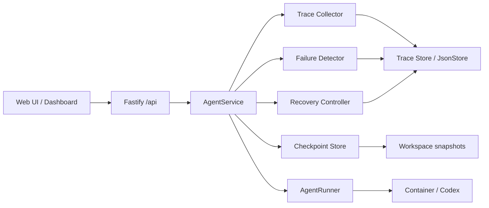
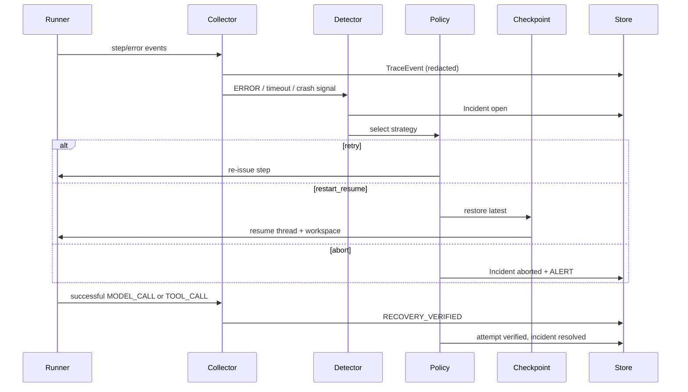

# Technical Requirements Document: AgentGuard

## 1. System Overview and Architectural Thesis

AgentGuard is a deterministic, observable middleware layer around the Volc Agent Launchpad runtime. Telemetry is the feedback loop; failures become incidents; recovery uses policy-driven actions; checkpoints let an Agent resume safely.

**Middleware story:** Team-designed reliability middleware (observability + deterministic recovery), aligned with official Trace/Observability and failure-recovery directions—not a mandatory single track. Optional legacy label: Glass Box + recovery. Product requirements: [AgentGuard PRD](./AgentGuard%20PRD.md).



## 2. Integration Points and Starter Seams

| Seam | File(s) | AgentGuard change |
| --- | --- | --- |
| Fastify routes | `apps/server/src/app.ts` | Add events, incidents, recoveries, fail-injection under `/api` |
| AgentService | `apps/server/src/agent-service.ts` | Emit/persist events; open incidents; invoke recovery; checkpoints |
| AgentRunner | `apps/server/src/types.ts`, `codex-runner.ts`, `container-codex-runner.ts` | Surface step-level events from Codex JSONL; support cancel/restart for injection |
| Types / DB | `apps/server/src/types.ts`, `store.ts` | Extend `Database` with `events`, `incidents`, `recoveryAttempts`, `checkpoints` |
| Workspace | `apps/server/src/workspace.ts` | Snapshot / restore helpers for checkpoint refs |
| Web UI | `apps/web/src/App.tsx`, `api.ts` | Timeline, incidents, recoveries, alert badge, usage display, inject-failure control |

Reuse existing run creation: `POST /api/agents/:id/messages` → creates `AgentRun`. Do **not** introduce a parallel `POST /runs` root.

## 3. Core Implementation Components

| Component | Module (proposed) | Responsibility |
| --- | --- | --- |
| Event / Trace Collector | `apps/server/src/agentguard/trace-collector.ts` | Map runner/Codex lines → `TraceEvent`; redact secrets |
| Trace Store | persistence via `JsonStore` | Persist events keyed by `run_id` |
| Failure Detector | `apps/server/src/agentguard/failure-detector.ts` | Classify failures; open `Incident` |
| Recovery Controller | `apps/server/src/agentguard/recovery-controller.ts` | Select policy; execute retry / restart_resume / abort; verify |
| Checkpoint Service | `apps/server/src/agentguard/checkpoint.ts` | Snapshot workspace + `codexThreadId`; restore |
| Redactor | `apps/server/src/agentguard/redact.ts` | Strip keys/tokens from metadata and errors |
| Dashboard | extend `apps/web` | Poll APIs; render timeline / incidents / recoveries / usage |

## 4. Canonical Schemas

### Enums

```text
RunStatus: queued | running | recovering | completed | failed | cancelled
IncidentStatus: open | recovering | resolved | aborted
RecoveryStatus: started | succeeded | failed | verified
FailureType: runtime_crash | tool_timeout | transient_tool_error | unknown
RecoveryStrategy: retry | restart_resume | abort
EventType: RUN_STARTED | RUN_COMPLETED | RUN_FAILED | MODEL_CALL | TOOL_CALL
  | CHECKPOINT_CREATED | ERROR | INCIDENT_OPENED | RECOVERY_STARTED
  | RECOVERY_COMPLETED | RECOVERY_FAILED | RECOVERY_VERIFIED | ALERT
EventStatus: ok | error | running
Severity: low | medium | high
```

### Entities

**Run** (extends starter `AgentRun`)

| Field | Type | Notes |
| --- | --- | --- |
| id | string | Existing run id; **trace id** for correlation |
| agentId | string | |
| status | RunStatus | Add `recovering` |
| sessionId / codexThreadId | string \| null | Align with agent `codexThreadId` |
| recoveryAttemptCount | number | Default 0 |
| startedAt / completedAt | string (ISO) | Existing timestamps |
| prompt / output / error / usage | existing | Expose `usage` on dashboard when present |

**TraceEvent**

| Field | Type | Notes |
| --- | --- | --- |
| id | string | **Span id** |
| runId | string | **Trace id** (same as run) |
| parentEventId | string \| null | Parent span for tree/timeline |
| type | EventType | |
| status | EventStatus | |
| timestamp | string (ISO) | |
| durationMs | number \| null | |
| metadata | object (redacted) | |
| error | string \| null (redacted) | |

MVP does not add separate `traceId`/`spanId` columns; document the mapping above in README/design summary.

**Incident**

| Field | Type |
| --- | --- |
| id | string |
| runId | string |
| eventId | string |
| failureType | FailureType |
| severity | Severity |
| status | IncidentStatus |
| createdAt / resolvedAt | string \| null |

**RecoveryAttempt**

| Field | Type |
| --- | --- |
| id | string |
| incidentId | string |
| runId | string |
| strategy | RecoveryStrategy |
| status | RecoveryStatus |
| startedAt / completedAt | string \| null |
| error | string \| null |

**Checkpoint**

| Field | Type |
| --- | --- |
| id | string |
| runId | string |
| agentId | string |
| codexThreadId | string \| null |
| workspaceSnapshotRef | string | Path under data root, e.g. `checkpoints/<runId>/<checkpointId>/` |
| boundary | string | e.g. `after_tool_call` |
| createdAt | string (ISO) |

### JsonStore extension

```text
Database v2:
  agents, messages, runs          # existing
  events: TraceEvent[]
  incidents: Incident[]
  recoveryAttempts: RecoveryAttempt[]
  checkpoints: Checkpoint[]       # metadata only; files on disk
```

## 5. State Machines

### Run

```text
queued -> running -> completed
                 \-> recovering -> running -> completed
                 \-> failed | cancelled
recovering -> failed   # abort or verification failure
```

### Incident

```text
open -> recovering -> resolved   # verified recovery
                  \-> aborted    # policy exhausted or unknown/abort strategy
```

### RecoveryAttempt

```text
started -> succeeded -> verified
        \-> failed
```

`verified` is set only after `RECOVERY_VERIFIED` is emitted (PRD §8).

## 6. Sequence: Failure → Recovery → Verify



## 7. Policy Engine Rules

| FailureType | Strategy | Limits |
| --- | --- | --- |
| `tool_timeout` | `retry` | Max 2 retries (3 attempts total); then `abort` + `ALERT` |
| `transient_tool_error` | `retry` | Same as timeout |
| `runtime_crash` | `restart_resume` | Max 1 restart_resume per incident; if no checkpoint → `abort` + `ALERT` |
| `unknown` | `abort` | Immediate abort + `ALERT` |
| Policy exhausted | `abort` | `ALERT` badge on run |

Backoff: attempt 1 immediate; attempt 2 after 10ms.  
Verification window: 60s after attempt `succeeded` for restart/retry paths.

Classification is rule-based (exit codes, runner timeout flags, injected fail type)—never LLM-invented recovery (ADR-001).

## 8. Checkpoint Mechanics

**When:** After each successful `MODEL_CALL` or `TOOL_CALL` boundary (and emit `CHECKPOINT_CREATED`).

**What:**

1. Copy agent workspace to `workspaceSnapshotRef` (atomic copy into `checkpoints/<runId>/<checkpointId>/`).
2. Persist current `codexThreadId` on the checkpoint record.
3. Keep last N=5 checkpoints per run; prune older snapshot dirs.

**Restore (`restart_resume`):**

1. Load latest valid checkpoint for the run.
2. Replace workspace contents from snapshot.
3. Set agent `codexThreadId` from checkpoint.
4. Re-enter `AgentRunner.run` with resume semantics (existing Codex resume).

**Invalid checkpoint:** If snapshot incomplete or missing, skip to previous; if none, abort.

## 9. APIs (aligned to `/api`)

| Method and endpoint | Purpose |
| --- | --- |
| `POST /api/agents/:id/messages` | Existing — create run (unchanged) |
| `GET /api/runs/:id` | Existing — run status (`recoveryAttemptCount`, `tokensUsed`, `tokenBudget`, `awaiting_approval`) |
| `GET /api/runs/:id/events` | Trace events for a run (ordered); `?format=download` for evidence export |
| `GET /api/incidents` | List incidents (`?runId=` optional filter) |
| `GET /api/runs/:id/recoveries` | Recovery attempts for a run |
| `GET /api/runs/:id/checkpoints` | Checkpoint metadata for a run (optional helper) |
| `POST /api/runs/:id/fail` | Inject controlled failure for demo/tests |
| `POST /api/runs/:id/approve` | Operator approve / abort while `awaiting_approval` |

### Failure injection

```json
POST /api/runs/:id/fail
{ "type": "runtime_crash" | "tool_timeout" | "budget_exceeded" }
```

Behavior:

- Run must be `running` or `recovering` (budget also accepted while awaiting approval for cancel race).
- Sets an in-memory injection flag; cancels the active runner so `AgentService` classifies the failure.
- `runtime_crash` → restart_resume from latest checkpoint (second crash may require approval).
- `tool_timeout` → retry from latest checkpoint (shared restore path with crash).
- `budget_exceeded` → pause for approve (raise budget + continue) or abort + ALERT.
- Deterministic for demos; does not rely on flaky external failures.

One-pager: [agentguard-architecture.md](agentguard-architecture.md).

## 10. Secret Redaction

Before persist or API response, redact from `metadata` and `error`:

- Env-style keys: `ARK_API_KEY`, `API_KEY`, `AUTHORIZATION`, `BEARER`, BytePlus-style `AK`/`SK` material
- Patterns: `sk-…`, `Bearer …`, long base64 tokens in headers

Replace with `[REDACTED]`. Unit-test the redactor with fixture strings.

**Surfaces that must stay clean (official acceptance):** source, Git history, logs, traces, screenshots, browser storage, and demo output. Never commit or display Ark model API keys or BytePlus account AK/SK. Never send the Ark key to the browser.

## 11. Architectural Decision Records

- **ADR-001 (Deterministic Recovery Policies):** Predefined strategies only; no LLM-invented recovery.
- **ADR-002 (Middleware Owns Recovery):** Recovery outside the Agent prompt loop.
- **ADR-003 (Event-Based Observability):** Structured `TraceEvent` stream as source of truth.
- **ADR-004 (Checkpointing):** Workspace + `codexThreadId` at successful step boundaries.
- **ADR-005 (Extend starter APIs):** Prefer `/api/runs/:id/...` over a parallel `/runs` API.
- **ADR-006 (Alert = UI only):** MVP alerts are dashboard badges + `ALERT` events.
- **ADR-007 (Trace/span mapping):** `runId` is the trace id; `eventId` is the span id; no duplicate ID fields in MVP.
- **ADR-008 (Team-designed story):** Official examples are optional; AgentGuard combines observability + recovery rather than claiming a mandatory named track.

## 12. Dashboard Technical Approach

- Extend `apps/web` playground / run panel; poll `GET /api/runs/:id`, `/events`, `/recoveries`, and `/api/incidents?runId=`.
- Run header shows starter `usage` when non-null.
- Poll interval: reuse existing run polling (~1s) while status is `running` or `recovering`.
- No SSE required for MVP.

## 13. Persistence and Concurrency

- Single-process `JsonStore` atomic writes; serialize mutations that touch events + incidents + recoveries in one store transaction where possible.
- One active run per agent (existing). Recovery does not start a second run id; it continues the same `runId` in `recovering` → `running`.
- Process death mid-recovery: on startup, in-flight runs → `cancelled` (starter behavior); mark open recovery attempts `failed`. No cross-process auto-resume in MVP.

## 14. Testing Strategy

### Unit

- Failure classification, policy selection, retry limits, state transitions, checkpoint create/restore, redaction.

### Integration

- AgentService → collector → detector → recovery → store → runner (with mocked runner).

### E2E

| Case | Expect |
| --- | --- |
| Normal successful run | Events timeline; no incidents |
| Runtime crash → restart/resume | Incident, checkpoint restore, `RECOVERY_VERIFIED`, run completed |
| Timeout → successful retry | `retry` then verified |
| Recovery exhaustion → abort | `ALERT`, incident `aborted`, run `failed` |

### Named fixtures (automated evidence)

- `fixtures/agentguard/crash-then-recover.jsonl` — golden event sequence
- `fixtures/agentguard/timeout-retry.jsonl`
- `fixtures/agentguard/secrets-redacted.json` — assert no raw key material

## 15. One-Page Architecture Diagram (deliverable)

Trust boundary = local container / ECS app process (unchanged from starter). Middleware sits inside the control plane. Diagram must show middleware, data flow, trust boundary, and the instrumentation / recovery point:

```text
[Browser UI] --no secrets--> [Fastify /api]
                               |
                     [AgentGuard: Trace | Detect | Recover | Checkpoint]
                               |
                         [AgentService]
                               |
                         [AgentRunner] --> [Runtime container / Codex] --> [Ark]
                               |
                    [JsonStore + workspace + checkpoint dirs]
```

Export this diagram for the submission one-pager (README or `docs/agentguard-architecture.png` when drawn).

## 16. Limitations (repo deliverable)

- Single-node JSON persistence; not multi-tenant or HA.
- No recovery across control-plane process restart.
- Alerts are UI-only.
- Classification covers a fixed failure taxonomy, not arbitrary faults.
- Checkpoints are best-effort file copies, not transactional filesystem snapshots.
- Not a replacement for production APM or distributed tracing.
- Trace/span IDs are mapped from `runId`/`eventId` rather than OpenTelemetry exporters.

## 17. Setup and Reproducibility

### Baseline first (official §3)

Do not rely on the AgentGuard demo until baseline acceptance passes: create Agent → hello-world CLI task completes → follow-up resumes Codex session → stop/restart preserves workspace.

### README (official §9.3)

Must include:

| Section | Content |
| --- | --- |
| Problem | Opaque Agent failures; observability not wired to recovery |
| Rationale | Deterministic policies + traces beat opaque restarts / LLM self-heal |
| Design summary | Trace / Detect / Recover / Checkpoint; `/api` seams; `runId`/`eventId` correlation |
| Setup | One-command local POC |
| Demo steps | Condensed PRD §15 including post-recovery controllability |
| Tests | AgentGuard unit/integration; submission gate |
| Limitations | Copy or link §16 |

```bash
ARK_API_KEY=… ARK_MODEL=… npm run poc
```

Open the UI, run the demo script from the PRD, use Inject failure for the crash path.

### Submission gate

```bash
npm run check
```

Must pass (TypeScript checks, server tests, production builds). AgentGuard tests are included in that suite.
