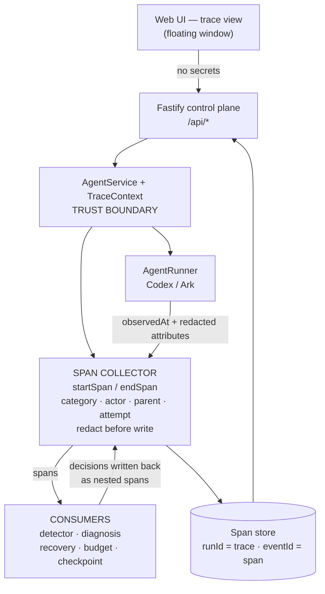

# Glass Box Span Model Implementation Plan

> **For agentic workers:** REQUIRED SUB-SKILL: Use superpowers:subagent-driven-development (recommended) or superpowers:executing-plans to implement this plan task-by-task. Steps use checkbox (`- [ ]`) syntax for tracking.

**Goal:** Turn AgentGuard's flat event log into a queryable span tree with category, actor, parent, attempt index, and honest durations — so a Run is diagnosable as a causal structure and recovery decisions appear nested under the span that caused them.

**Architecture:** `TraceEvent` becomes a span. A single taxonomy table maps `EventType` to a default `SpanCategory` and `ActorType`, so emission sites do not each pass them. The collector gains a `startSpan`/`endSpan` lifecycle alongside point-in-time events. A new `span-tree.ts` builds nested trees and computes run summaries. `AgentService` threads an explicit `TraceContext` so incident, diagnosis, and recovery spans parent to the failing span.

**Tech Stack:** TypeScript (ESM, `.js` import specifiers), Fastify 5, Vitest 4, React 19 + Vite, `JsonStore` (single-process JSON persistence).

## Global Constraints

- Design of record: [span model design](../specs/2026-08-27-glass-box-span-model-design.md). Requirements: [PRD](../../AgentGuard%20PRD.md). Contracts: [TRD](../../AgentGuard%20TRD.md).
- ESM only. **Server code (`apps/server`) uses `.js` import specifiers** on relative imports, including from `.ts` files. **Web code (`apps/web`) omits extensions** — Vite resolves them. Match the file you are editing.
- Server routes parse params and query with **zod** and return **envelope objects** (`{ events }`, `{ agent }`, `{ run }`), never bare arrays. Follow the existing shape in `app.ts`.
- The web client calls the server through the `api` object and its `request<T>(url, options)` helper in `apps/web/src/api.ts`. Do not call `fetch` directly.
- Every span has non-null `category`, `actor`, and `attemptIndex`.
- The parent chain is acyclic and roots at the run span.
- **The middleware never fabricates a span.** No span may carry `metadata.synthesized`.
- `durationMs` is measured, derived with `durationSource` recorded, or legitimately null for point-in-time events.
- Redaction happens before persistence, never only before display.
- Attribute truncation limits are fixed: 200 characters for `command`, `preview`, and `outputPreview`.
- Submission gate: `npm run check` (typecheck + tests + builds) must pass.
- Do not rebuild Agent CRUD, playground chat, or the runtime. Preserve baseline lifecycle.
- Never log, persist, or display Ark API keys or BytePlus AK/SK.

## Parallelization

Two engineers. **Tasks 1–3 must land before anything else** — they define the shared contract.

| Engineer | Tasks |
| --- | --- |
| Server | 1, 2, 3, then 4, 5, 6, 7, 8, 9, 10 |
| Web | Waits for Task 1 to merge, then 11, 12, 13, 14 |
| Shared | 15 (docs) |

The Web engineer builds against `buildSpanTree` (Task 3) and fixtures, not a running server, so they are not blocked by Tasks 4–10.

---

### Task 1: Span types and legacy normalization

**Files:**
- Modify: `apps/server/src/types.ts:27-51` (EventType), `:111-121` (TraceEvent), `:254-259` (RunnerStreamEvent)
- Create: `apps/server/src/agentguard/span-taxonomy.ts`
- Create: `apps/server/src/agentguard/span-taxonomy.test.ts`
- Modify: `apps/server/src/store.ts:18-50` (migrateDatabase)

**Interfaces:**
- Produces: `SpanCategory`, `ActorType`, `DurationSource` types; `categoryForEventType(type: EventType): SpanCategory`; `actorForEventType(type: EventType): ActorType`; `TraceEvent` with `category`, `actor`, `endedAt`, `durationSource`, `attemptIndex`.
- Consumes: nothing.

- [ ] **Step 1: Write the failing taxonomy test**

Create `apps/server/src/agentguard/span-taxonomy.test.ts`:

```ts
import { describe, expect, it } from "vitest";
import type { EventType } from "../types.js";
import { actorForEventType, categoryForEventType } from "./span-taxonomy.js";

const ALL_EVENT_TYPES: EventType[] = [
  "RUN_STARTED", "TURN", "RUN_COMPLETED", "RUN_FAILED", "MODEL_CALL",
  "TOOL_CALL", "CHECKPOINT_CREATED", "CHECKPOINT_RESTORED", "ERROR",
  "INCIDENT_OPENED", "DIAGNOSIS_ISSUED", "DIAGNOSIS_VERDICT",
  "RECOVERY_STARTED", "RECOVERY_COMPLETED", "RECOVERY_FAILED",
  "RECOVERY_VERIFIED", "ALERT", "APPROVAL_REQUESTED", "APPROVAL_GRANTED",
  "APPROVAL_DENIED", "BUDGET_SOFT_LIMIT", "BUDGET_PROJECTED_EXCEED",
  "BUDGET_COMPRESSED", "BUDGET_EXCEEDED", "BUDGET_RAISED",
];

describe("span taxonomy", () => {
  it("assigns a category and actor to every event type", () => {
    for (const type of ALL_EVENT_TYPES) {
      expect(categoryForEventType(type), type).toBeTruthy();
      expect(actorForEventType(type), type).toBeTruthy();
    }
  });

  it("categorises orchestration, model, and tool spans", () => {
    expect(categoryForEventType("TURN")).toBe("orchestration");
    expect(categoryForEventType("MODEL_CALL")).toBe("model_call");
    expect(categoryForEventType("TOOL_CALL")).toBe("tool_call");
    expect(categoryForEventType("CHECKPOINT_RESTORED")).toBe("checkpoint");
    expect(categoryForEventType("DIAGNOSIS_ISSUED")).toBe("policy_decision");
    expect(categoryForEventType("APPROVAL_GRANTED")).toBe("human_approval");
    expect(categoryForEventType("RECOVERY_VERIFIED")).toBe("recovery");
  });

  it("attributes human decisions to the human actor", () => {
    expect(actorForEventType("RUN_STARTED")).toBe("human");
    expect(actorForEventType("APPROVAL_GRANTED")).toBe("human");
    expect(actorForEventType("APPROVAL_DENIED")).toBe("human");
    expect(actorForEventType("BUDGET_RAISED")).toBe("human");
    expect(actorForEventType("MODEL_CALL")).toBe("agent");
    expect(actorForEventType("TOOL_CALL")).toBe("agent");
    expect(actorForEventType("RECOVERY_STARTED")).toBe("middleware");
  });
});
```

- [ ] **Step 2: Run test to verify it fails**

Run: `cd apps/server && npx vitest run src/agentguard/span-taxonomy.test.ts`
Expected: FAIL — cannot resolve `./span-taxonomy.js`.

- [ ] **Step 3: Add the new types**

In `apps/server/src/types.ts`, add after the `EventStatus` declaration (line 51):

```ts
export type SpanCategory =
  | "orchestration"
  | "model_call"
  | "tool_call"
  | "checkpoint"
  | "policy_decision"
  | "human_approval"
  | "recovery";

export type ActorType = "human" | "agent" | "middleware";

export type DurationSource = "measured" | "inter_item_delta";
```

Extend `EventType` (line 27) by adding these two members:

```ts
  | "TURN"
  | "CHECKPOINT_RESTORED"
```

Replace `TraceEvent` (lines 111-121) with:

```ts
export interface TraceEvent {
  id: string;
  runId: string;
  parentEventId: string | null;
  type: EventType;
  category: SpanCategory;
  actor: ActorType;
  status: EventStatus;
  timestamp: string;
  endedAt: string | null;
  durationMs: number | null;
  durationSource: DurationSource | null;
  attemptIndex: number;
  metadata: Record<string, unknown>;
  error: string | null;
}
```

Replace `RunnerStreamEvent` (lines 254-259) with:

```ts
export interface RunnerStreamEvent {
  type: EventType;
  status: EventStatus;
  observedAt?: number;
  metadata?: Record<string, unknown>;
  error?: string | null;
}
```

- [ ] **Step 4: Create the taxonomy module**

Create `apps/server/src/agentguard/span-taxonomy.ts`:

```ts
import type { ActorType, EventType, SpanCategory } from "../types.js";

const CATEGORY: Record<EventType, SpanCategory> = {
  RUN_STARTED: "orchestration",
  TURN: "orchestration",
  RUN_COMPLETED: "orchestration",
  RUN_FAILED: "orchestration",
  MODEL_CALL: "model_call",
  TOOL_CALL: "tool_call",
  ERROR: "tool_call",
  CHECKPOINT_CREATED: "checkpoint",
  CHECKPOINT_RESTORED: "checkpoint",
  INCIDENT_OPENED: "policy_decision",
  DIAGNOSIS_ISSUED: "policy_decision",
  DIAGNOSIS_VERDICT: "policy_decision",
  ALERT: "policy_decision",
  BUDGET_SOFT_LIMIT: "policy_decision",
  BUDGET_PROJECTED_EXCEED: "policy_decision",
  BUDGET_COMPRESSED: "policy_decision",
  BUDGET_EXCEEDED: "policy_decision",
  BUDGET_RAISED: "policy_decision",
  APPROVAL_REQUESTED: "human_approval",
  APPROVAL_GRANTED: "human_approval",
  APPROVAL_DENIED: "human_approval",
  RECOVERY_STARTED: "recovery",
  RECOVERY_COMPLETED: "recovery",
  RECOVERY_FAILED: "recovery",
  RECOVERY_VERIFIED: "recovery",
};

const ACTOR: Record<EventType, ActorType> = {
  RUN_STARTED: "human",
  APPROVAL_GRANTED: "human",
  APPROVAL_DENIED: "human",
  BUDGET_RAISED: "human",
  MODEL_CALL: "agent",
  TOOL_CALL: "agent",
  ERROR: "agent",
  TURN: "middleware",
  RUN_COMPLETED: "middleware",
  RUN_FAILED: "middleware",
  CHECKPOINT_CREATED: "middleware",
  CHECKPOINT_RESTORED: "middleware",
  INCIDENT_OPENED: "middleware",
  DIAGNOSIS_ISSUED: "middleware",
  DIAGNOSIS_VERDICT: "middleware",
  ALERT: "middleware",
  APPROVAL_REQUESTED: "middleware",
  BUDGET_SOFT_LIMIT: "middleware",
  BUDGET_PROJECTED_EXCEED: "middleware",
  BUDGET_COMPRESSED: "middleware",
  BUDGET_EXCEEDED: "middleware",
  RECOVERY_STARTED: "middleware",
  RECOVERY_COMPLETED: "middleware",
  RECOVERY_FAILED: "middleware",
  RECOVERY_VERIFIED: "middleware",
};

export function categoryForEventType(type: EventType): SpanCategory {
  return CATEGORY[type] ?? "orchestration";
}

export function actorForEventType(type: EventType): ActorType {
  return ACTOR[type] ?? "middleware";
}
```

Because both maps are `Record<EventType, …>`, adding an `EventType` later without updating them is a compile error. That is intentional.

- [ ] **Step 5: Run test to verify it passes**

Run: `cd apps/server && npx vitest run src/agentguard/span-taxonomy.test.ts`
Expected: PASS — 3 tests.

- [ ] **Step 6: Normalize legacy events in the store**

In `apps/server/src/store.ts`, add this import at the top:

```ts
import { actorForEventType, categoryForEventType } from "./agentguard/span-taxonomy.js";
```

Inside `migrateDatabase`, after the `runs` mapping (line 34), add:

```ts
  const events = (parsed.events ?? []).map((event) => ({
    ...event,
    category: event.category ?? categoryForEventType(event.type),
    actor: event.actor ?? actorForEventType(event.type),
    endedAt: event.endedAt === undefined ? null : event.endedAt,
    durationSource: event.durationSource === undefined ? null : event.durationSource,
    attemptIndex: typeof event.attemptIndex === "number" ? event.attemptIndex : 0,
  }));
```

Then change the returned `events: parsed.events ?? [],` (line 40) to:

```ts
    events,
```

- [ ] **Step 7: Verify typecheck and full suite**

Run: `cd apps/server && npx tsc -p tsconfig.json --noEmit`
Expected: errors only in `trace-collector.ts` (missing required span fields) — those are fixed in Task 2. Note them and continue.

- [ ] **Step 8: Commit**

```bash
git add apps/server/src/types.ts apps/server/src/store.ts apps/server/src/agentguard/span-taxonomy.ts apps/server/src/agentguard/span-taxonomy.test.ts
git commit -m "Add span category, actor, and duration-source types with taxonomy defaults"
```

---

### Task 2: Span lifecycle in the collector

**Files:**
- Modify: `apps/server/src/agentguard/trace-collector.ts` (whole file)
- Create: `apps/server/src/agentguard/trace-collector.test.ts`

**Interfaces:**
- Consumes: `categoryForEventType`, `actorForEventType` from Task 1.
- Produces: `appendTraceEvent(store, input): Promise<TraceEvent>` (input gains optional `category`, `actor`, `attemptIndex`, `durationSource`); `startSpan(store, input): Promise<string>`; `endSpan(store, spanId, patch): Promise<void>`; `eventsForRun(store, runId): TraceEvent[]` (unchanged signature).

- [ ] **Step 1: Write the failing test**

Create `apps/server/src/agentguard/trace-collector.test.ts`:

```ts
import { mkdtemp, rm } from "node:fs/promises";
import { tmpdir } from "node:os";
import path from "node:path";
import { afterEach, describe, expect, it } from "vitest";
import { JsonStore } from "../store.js";
import { appendTraceEvent, endSpan, eventsForRun, startSpan } from "./trace-collector.js";

const temporaryDirectories: string[] = [];

afterEach(async () => {
  await Promise.all(
    temporaryDirectories.splice(0).map((directory) =>
      rm(directory, { recursive: true, force: true }),
    ),
  );
});

async function makeStore(): Promise<JsonStore> {
  const root = await mkdtemp(path.join(tmpdir(), "agentguard-tc-"));
  temporaryDirectories.push(root);
  const store = new JsonStore(path.join(root, "db.json"));
  await store.initialize();
  return store;
}

describe("trace collector", () => {
  it("defaults category and actor from the event type", async () => {
    const store = await makeStore();
    const event = await appendTraceEvent(store, {
      runId: "run-1",
      type: "TOOL_CALL",
      status: "ok",
    });
    expect(event.category).toBe("tool_call");
    expect(event.actor).toBe("agent");
    expect(event.attemptIndex).toBe(0);
    expect(event.durationMs).toBeNull();
    expect(event.durationSource).toBeNull();
    expect(event.endedAt).toBeNull();
  });

  it("allows an explicit actor override", async () => {
    const store = await makeStore();
    const event = await appendTraceEvent(store, {
      runId: "run-1",
      type: "TOOL_CALL",
      status: "ok",
      actor: "middleware",
    });
    expect(event.actor).toBe("middleware");
  });

  it("opens a span as running and closes it with a measured duration", async () => {
    const store = await makeStore();
    const spanId = await startSpan(store, {
      runId: "run-1",
      type: "TURN",
      attemptIndex: 2,
      metadata: { tier: "normal" },
    });

    const opened = eventsForRun(store, "run-1")[0];
    expect(opened?.status).toBe("running");
    expect(opened?.attemptIndex).toBe(2);

    await endSpan(store, spanId, { status: "ok", metadata: { usage: 12 } });

    const closed = eventsForRun(store, "run-1")[0];
    expect(closed?.status).toBe("ok");
    expect(closed?.endedAt).not.toBeNull();
    expect(closed?.durationMs).toBeGreaterThanOrEqual(0);
    expect(closed?.durationSource).toBe("measured");
    expect(closed?.metadata.tier).toBe("normal");
    expect(closed?.metadata.usage).toBe(12);
  });

  it("records a supplied duration source and redacts errors on close", async () => {
    const store = await makeStore();
    const spanId = await startSpan(store, { runId: "run-1", type: "TOOL_CALL" });
    await endSpan(store, spanId, {
      status: "error",
      error: "failed with ARK_API_KEY=sk-secret-value",
      durationSource: "inter_item_delta",
    });
    const closed = eventsForRun(store, "run-1")[0];
    expect(closed?.durationSource).toBe("inter_item_delta");
    expect(closed?.error).not.toContain("sk-secret-value");
  });

  it("ignores endSpan for an unknown span id", async () => {
    const store = await makeStore();
    await expect(endSpan(store, "missing", { status: "ok" })).resolves.toBeUndefined();
  });
});
```

- [ ] **Step 2: Run test to verify it fails**

Run: `cd apps/server && npx vitest run src/agentguard/trace-collector.test.ts`
Expected: FAIL — `startSpan` and `endSpan` are not exported.

- [ ] **Step 3: Rewrite the collector**

Replace the whole of `apps/server/src/agentguard/trace-collector.ts`:

```ts
import { randomUUID } from "node:crypto";
import type { JsonStore } from "../store.js";
import type {
  ActorType,
  DurationSource,
  EventStatus,
  EventType,
  SpanCategory,
  TraceEvent,
} from "../types.js";
import { redactError, redactMetadata } from "./redact.js";
import { actorForEventType, categoryForEventType } from "./span-taxonomy.js";

export interface SpanInput {
  runId: string;
  type: EventType;
  status?: EventStatus;
  category?: SpanCategory;
  actor?: ActorType;
  parentEventId?: string | null;
  attemptIndex?: number;
  durationMs?: number | null;
  durationSource?: DurationSource | null;
  metadata?: Record<string, unknown>;
  error?: string | null;
}

export interface SpanPatch {
  status: EventStatus;
  error?: string | null;
  metadata?: Record<string, unknown>;
  durationSource?: DurationSource;
}

export async function appendTraceEvent(
  store: JsonStore,
  input: SpanInput & { status: EventStatus },
): Promise<TraceEvent> {
  const event: TraceEvent = {
    id: randomUUID(),
    runId: input.runId,
    parentEventId: input.parentEventId ?? null,
    type: input.type,
    category: input.category ?? categoryForEventType(input.type),
    actor: input.actor ?? actorForEventType(input.type),
    status: input.status,
    timestamp: new Date().toISOString(),
    endedAt: null,
    durationMs: input.durationMs ?? null,
    durationSource: input.durationSource ?? null,
    attemptIndex: input.attemptIndex ?? 0,
    metadata: redactMetadata(input.metadata ?? {}),
    error: redactError(input.error),
  };
  await store.mutate((database) => {
    database.events.push(event);
  });
  return event;
}

export async function startSpan(store: JsonStore, input: SpanInput): Promise<string> {
  const event = await appendTraceEvent(store, { ...input, status: "running" });
  return event.id;
}

export async function endSpan(
  store: JsonStore,
  spanId: string,
  patch: SpanPatch,
): Promise<void> {
  const endedAt = new Date().toISOString();
  await store.mutate((database) => {
    const span = database.events.find((event) => event.id === spanId);
    if (!span) return;
    span.status = patch.status;
    span.endedAt = endedAt;
    span.durationMs = Math.max(0, Date.parse(endedAt) - Date.parse(span.timestamp));
    span.durationSource = patch.durationSource ?? "measured";
    if (patch.error !== undefined) {
      span.error = redactError(patch.error);
    }
    if (patch.metadata) {
      span.metadata = { ...span.metadata, ...redactMetadata(patch.metadata) };
    }
  });
}

export function eventsForRun(store: JsonStore, runId: string): TraceEvent[] {
  return store
    .snapshot()
    .events.filter((event) => event.runId === runId)
    .sort((left, right) => left.timestamp.localeCompare(right.timestamp));
}
```

- [ ] **Step 4: Run test to verify it passes**

Run: `cd apps/server && npx vitest run src/agentguard/trace-collector.test.ts`
Expected: PASS — 5 tests.

- [ ] **Step 5: Run the full suite for regressions**

Run: `npm run test -w @launchpad/server`
Expected: PASS — all pre-existing tests still green (59 + 8 new).

- [ ] **Step 6: Commit**

```bash
git add apps/server/src/agentguard/trace-collector.ts apps/server/src/agentguard/trace-collector.test.ts
git commit -m "Add startSpan and endSpan lifecycle to the trace collector"
```

---

### Task 3: Span tree builder

**Files:**
- Create: `apps/server/src/agentguard/span-tree.ts`
- Create: `apps/server/src/agentguard/span-tree.test.ts`

**Interfaces:**
- Consumes: `TraceEvent` from Task 1.
- Produces: `SpanNode` (extends `TraceEvent` with `matched: boolean` and `children: SpanNode[]`); `SpanFilter`; `matchesFilter(event, filter): boolean`; `buildSpanTree(events, filter?): SpanNode[]`; `summarizeRun(events): RunSummary` where `RunSummary = { spanCount: number; errorCount: number; durationMs: number | null }`.

- [ ] **Step 1: Write the failing test**

Create `apps/server/src/agentguard/span-tree.test.ts`:

```ts
import { describe, expect, it } from "vitest";
import type { TraceEvent } from "../types.js";
import { buildSpanTree, matchesFilter, summarizeRun } from "./span-tree.js";

function span(overrides: Partial<TraceEvent> & { id: string }): TraceEvent {
  return {
    runId: "run-1",
    parentEventId: null,
    type: "TOOL_CALL",
    category: "tool_call",
    actor: "agent",
    status: "ok",
    timestamp: "2026-08-27T10:00:00.000Z",
    endedAt: null,
    durationMs: null,
    durationSource: null,
    attemptIndex: 0,
    metadata: {},
    error: null,
    ...overrides,
  };
}

const TREE: TraceEvent[] = [
  span({ id: "run", type: "RUN_STARTED", category: "orchestration", actor: "human", timestamp: "2026-08-27T10:00:00.000Z" }),
  span({ id: "turn", type: "TURN", category: "orchestration", actor: "middleware", parentEventId: "run", timestamp: "2026-08-27T10:00:01.000Z" }),
  span({ id: "model", type: "MODEL_CALL", category: "model_call", parentEventId: "turn", timestamp: "2026-08-27T10:00:02.000Z" }),
  span({ id: "tool", parentEventId: "turn", status: "error", timestamp: "2026-08-27T10:00:03.000Z" }),
  span({ id: "incident", type: "INCIDENT_OPENED", category: "policy_decision", actor: "middleware", parentEventId: "tool", timestamp: "2026-08-27T10:00:04.000Z" }),
];

describe("span tree", () => {
  it("nests spans by parent and returns a single root", () => {
    const roots = buildSpanTree(TREE);
    expect(roots).toHaveLength(1);
    expect(roots[0]?.id).toBe("run");
    expect(roots[0]?.children[0]?.id).toBe("turn");
    expect(roots[0]?.children[0]?.children.map((c) => c.id)).toEqual(["model", "tool"]);
    expect(roots[0]?.children[0]?.children[1]?.children[0]?.id).toBe("incident");
  });

  it("marks every span matched when no filter is supplied", () => {
    const roots = buildSpanTree(TREE);
    expect(roots[0]?.matched).toBe(true);
    expect(roots[0]?.children[0]?.matched).toBe(true);
  });

  it("keeps non-matching ancestors as unmatched scaffolding", () => {
    const roots = buildSpanTree(TREE, { status: ["error"] });
    expect(roots).toHaveLength(1);
    const run = roots[0]!;
    expect(run.matched).toBe(false);
    const turn = run.children[0]!;
    expect(turn.matched).toBe(false);
    expect(turn.children).toHaveLength(1);
    expect(turn.children[0]?.id).toBe("tool");
    expect(turn.children[0]?.matched).toBe(true);
  });

  it("drops branches with no matching descendant", () => {
    const roots = buildSpanTree(TREE, { category: ["model_call"] });
    const turn = roots[0]!.children[0]!;
    expect(turn.children.map((child) => child.id)).toEqual(["model"]);
  });

  it("returns an empty array when nothing matches", () => {
    expect(buildSpanTree(TREE, { actor: ["human"], status: ["error"] })).toEqual([]);
  });

  it("treats a span with a missing parent as a root", () => {
    const orphan = [span({ id: "lonely", parentEventId: "gone" })];
    expect(buildSpanTree(orphan).map((node) => node.id)).toEqual(["lonely"]);
  });

  it("breaks parent cycles instead of recursing forever", () => {
    const cyclic = [
      span({ id: "a", parentEventId: "b" }),
      span({ id: "b", parentEventId: "a" }),
    ];
    const roots = buildSpanTree(cyclic);
    expect(roots.length).toBeGreaterThan(0);
  });

  it("composes filters with AND", () => {
    const event = span({ id: "x", status: "error", actor: "agent" });
    expect(matchesFilter(event, { status: ["error"], actor: ["agent"] })).toBe(true);
    expect(matchesFilter(event, { status: ["error"], actor: ["human"] })).toBe(false);
  });

  it("filters by since timestamp", () => {
    const event = span({ id: "x", timestamp: "2026-08-27T10:00:03.000Z" });
    expect(matchesFilter(event, { since: "2026-08-27T10:00:02.000Z" })).toBe(true);
    expect(matchesFilter(event, { since: "2026-08-27T10:00:04.000Z" })).toBe(false);
  });

  it("summarises span count, error count, and wall duration", () => {
    const summary = summarizeRun(TREE);
    expect(summary.spanCount).toBe(5);
    expect(summary.errorCount).toBe(1);
    expect(summary.durationMs).toBe(4000);
  });

  it("returns a null duration for an empty run", () => {
    expect(summarizeRun([])).toEqual({ spanCount: 0, errorCount: 0, durationMs: null });
  });
});
```

- [ ] **Step 2: Run test to verify it fails**

Run: `cd apps/server && npx vitest run src/agentguard/span-tree.test.ts`
Expected: FAIL — cannot resolve `./span-tree.js`.

- [ ] **Step 3: Create the span tree module**

Create `apps/server/src/agentguard/span-tree.ts`:

```ts
import type {
  ActorType,
  EventStatus,
  SpanCategory,
  TraceEvent,
} from "../types.js";

export interface SpanNode extends TraceEvent {
  matched: boolean;
  children: SpanNode[];
}

export interface SpanFilter {
  category?: SpanCategory[];
  actor?: ActorType[];
  status?: EventStatus[];
  since?: string;
}

export interface RunSummary {
  spanCount: number;
  errorCount: number;
  durationMs: number | null;
}

export function matchesFilter(event: TraceEvent, filter: SpanFilter): boolean {
  if (filter.category && !filter.category.includes(event.category)) return false;
  if (filter.actor && !filter.actor.includes(event.actor)) return false;
  if (filter.status && !filter.status.includes(event.status)) return false;
  if (filter.since && event.timestamp < filter.since) return false;
  return true;
}

function hasCycle(
  event: TraceEvent,
  byId: Map<string, TraceEvent>,
): boolean {
  const seen = new Set<string>([event.id]);
  let current = event.parentEventId;
  while (current) {
    if (seen.has(current)) return true;
    seen.add(current);
    current = byId.get(current)?.parentEventId ?? null;
  }
  return false;
}

function prune(node: SpanNode): SpanNode | null {
  const children = node.children
    .map(prune)
    .filter((child): child is SpanNode => child !== null);
  if (!node.matched && children.length === 0) return null;
  return { ...node, children };
}

export function buildSpanTree(
  events: TraceEvent[],
  filter?: SpanFilter,
): SpanNode[] {
  const byId = new Map(events.map((event) => [event.id, event]));
  const nodes = new Map<string, SpanNode>();
  for (const event of events) {
    nodes.set(event.id, {
      ...event,
      matched: filter ? matchesFilter(event, filter) : true,
      children: [],
    });
  }

  const roots: SpanNode[] = [];
  for (const event of events) {
    const node = nodes.get(event.id);
    if (!node) continue;
    const parent = event.parentEventId ? nodes.get(event.parentEventId) : undefined;
    if (!parent || hasCycle(event, byId)) {
      roots.push(node);
      continue;
    }
    parent.children.push(node);
  }

  if (!filter) return roots;
  return roots.map(prune).filter((node): node is SpanNode => node !== null);
}

export function summarizeRun(events: TraceEvent[]): RunSummary {
  if (events.length === 0) {
    return { spanCount: 0, errorCount: 0, durationMs: null };
  }
  const times = events
    .map((event) => Date.parse(event.timestamp))
    .filter((value) => Number.isFinite(value));
  return {
    spanCount: events.length,
    errorCount: events.filter((event) => event.status === "error").length,
    durationMs: times.length > 0 ? Math.max(...times) - Math.min(...times) : null,
  };
}
```

- [ ] **Step 4: Run test to verify it passes**

Run: `cd apps/server && npx vitest run src/agentguard/span-tree.test.ts`
Expected: PASS — 11 tests.

- [ ] **Step 5: Commit**

```bash
git add apps/server/src/agentguard/span-tree.ts apps/server/src/agentguard/span-tree.test.ts
git commit -m "Add span tree builder with hierarchy-preserving filters"
```

> **Contract freeze.** Tasks 1–3 are now merged. Tell the Web engineer to start Task 11.

---

### Task 4: Turn spans replace the synthetic span

**Files:**
- Modify: `apps/server/src/agent-service.ts:424-694` (executeRun)
- Modify: `apps/server/src/agentguard/agentguard.integration.test.ts` (add test)

**Interfaces:**
- Consumes: `startSpan`, `endSpan` (Task 2).
- Produces: a `TraceContext` object local to `executeRun` with fields `runId`, `runSpanId`, `turnSpanId`, `failingSpanId`, `attemptIndex`. Every `TURN` span carries `metadata.attemptIndex`, `metadata.tier`, `metadata.promptWrapped`, and on close `metadata.usage`.

- [ ] **Step 1: Write the failing test**

Append to the `describe("AgentGuard integration", ...)` block in `apps/server/src/agentguard/agentguard.integration.test.ts`:

```ts
  it("emits a real turn span and never fabricates telemetry", async () => {
    const runner: AgentRunner = {
      async run(): Promise<RunnerResult> {
        return { output: "quiet", threadId: "thread-quiet", usage: null };
      },
      cancel: async () => false,
      isAvailable: async () => true,
    };
    const service = await makeService(runner);
    const agent = await service.createAgent({ name: "Quiet" });
    const { run } = await service.sendMessage(agent.id, "say nothing");
    await expect.poll(() => service.getRun(run.id).status).toBe("completed");

    const events = service.getEvents(run.id);
    const turn = events.find((event) => event.type === "TURN");
    expect(turn).toBeDefined();
    expect(turn?.status).toBe("ok");
    expect(turn?.durationMs).toBeGreaterThanOrEqual(0);
    expect(turn?.durationSource).toBe("measured");
    expect(turn?.attemptIndex).toBe(0);
    expect(events.every((event) => event.metadata.synthesized === undefined)).toBe(true);
    expect(events.every((event) => event.category !== undefined)).toBe(true);
    expect(events.every((event) => event.actor !== undefined)).toBe(true);
  });
```

- [ ] **Step 2: Run test to verify it fails**

Run: `cd apps/server && npx vitest run src/agentguard/agentguard.integration.test.ts -t "never fabricates"`
Expected: FAIL — no `TURN` event exists; a `MODEL_CALL` with `metadata.synthesized` is present instead.

- [ ] **Step 3: Add the trace context and run span**

In `apps/server/src/agent-service.ts`, add to the imports from `./agentguard/trace-collector.js`:

```ts
import { appendTraceEvent, endSpan, eventsForRun, startSpan } from "./agentguard/trace-collector.js";
```

Add this interface just above the `AgentService` class declaration:

```ts
interface TraceContext {
  runId: string;
  runSpanId: string;
  turnSpanId: string | null;
  failingSpanId: string | null;
  attemptIndex: number;
}
```

In `executeRun`, replace the `RUN_STARTED` emission (lines 432-437) with:

```ts
    const runSpan = await appendTraceEvent(this.store, {
      runId: run.id,
      type: "RUN_STARTED",
      status: "ok",
      metadata: { agentId: agentAtStart.id },
    });
    const trace: TraceContext = {
      runId: run.id,
      runSpanId: runSpan.id,
      turnSpanId: null,
      failingSpanId: null,
      attemptIndex: 0,
    };
```

- [ ] **Step 4: Wrap the runner call in a turn span**

Still in `executeRun`, immediately before `const result = await this.runner.run({` (line 489), insert:

```ts
        trace.attemptIndex = attempts - 1;
        trace.turnSpanId = await startSpan(this.store, {
          runId: run.id,
          type: "TURN",
          parentEventId: trace.runSpanId,
          attemptIndex: trace.attemptIndex,
          metadata: {
            tier: prepared.lastEmittedTier,
            promptWrapped: promptForRunner !== turnPrompt,
            codexThreadId: agent.codexThreadId,
          },
        });
```

Inside the `onEvent` callback (line 495), change the `appendTraceEvent` call to parent to the turn span:

```ts
            await appendTraceEvent(this.store, {
              runId: run.id,
              type: event.type,
              status: event.status,
              parentEventId: trace.turnSpanId,
              attemptIndex: trace.attemptIndex,
              metadata: event.metadata ?? {},
              error: event.error ?? null,
            });
```

- [ ] **Step 5: Close the turn span and delete the synthetic span**

Replace the synthetic-span block (lines 555-568) with:

```ts
        if (trace.turnSpanId) {
          await endSpan(this.store, trace.turnSpanId, {
            status: "ok",
            metadata: { usage: result.usage },
          });
          await this.checkpointAfterSpan(agent.id, run.id, "after_turn");
          agent = this.getAgent(agent.id);
        }
```

In the `catch` block, immediately after `const message = error instanceof Error ? error.message : String(error);` (line 697), add:

```ts
        if (trace.turnSpanId) {
          await endSpan(this.store, trace.turnSpanId, { status: "error", error: message });
          trace.failingSpanId = trace.turnSpanId;
          trace.turnSpanId = null;
        }
```

- [ ] **Step 6: Run test to verify it passes**

Run: `cd apps/server && npx vitest run src/agentguard/agentguard.integration.test.ts -t "never fabricates"`
Expected: PASS.

- [ ] **Step 7: Run the full suite**

Run: `npm run test -w @launchpad/server`
Expected: PASS. If a pre-existing test asserted the synthetic `MODEL_CALL`, update it to assert `TURN` instead — that assertion was testing the bug.

- [ ] **Step 8: Commit**

```bash
git add apps/server/src/agent-service.ts apps/server/src/agentguard/agentguard.integration.test.ts
git commit -m "Replace synthetic span with a measured turn span"
```

---

### Task 5: Parent the closed loop under the failing span

**Files:**
- Modify: `apps/server/src/agent-service.ts` (`handleFailure`, `checkpointAfterSpan`, `startCheckpointedRecovery`)
- Modify: `apps/server/src/agentguard/agentguard.integration.test.ts` (add test)

**Interfaces:**
- Consumes: `TraceContext` (Task 4), `buildSpanTree` (Task 3).
- Produces: incident, diagnosis, and recovery spans carry `parentEventId === trace.failingSpanId`; `RECOVERY_VERIFIED` parents to the successful turn span.

- [ ] **Step 1: Write the failing test**

Append to `apps/server/src/agentguard/agentguard.integration.test.ts`:

```ts
  it("nests incident and recovery spans under the failing span", async () => {
    let calls = 0;
    let rejectFirst!: (error: Error) => void;
    const firstHang = new Promise<RunnerResult>((_resolve, reject) => {
      rejectFirst = reject;
    });
    const runner: AgentRunner = {
      async run(request: RunnerRequest): Promise<RunnerResult> {
        calls += 1;
        await request.onEvent?.({ type: "TOOL_CALL", status: "ok", metadata: { step: calls } });
        if (calls === 1) return firstHang;
        return { output: "recovered", threadId: "thread-2", usage: null };
      },
      cancel: async () => {
        rejectFirst(new RunCancelledError());
        return true;
      },
      isAvailable: async () => true,
    };
    const service = await makeService(runner);
    const agent = await service.createAgent({ name: "Nested" });
    const { run } = await service.sendMessage(agent.id, "do work");
    await expect.poll(() =>
      service.getEvents(run.id).some((event) => event.type === "CHECKPOINT_CREATED"),
    ).toBe(true);
    await service.injectFailure(run.id, "runtime_crash");
    await expect.poll(() => service.getRun(run.id).status).toBe("completed");

    const events = service.getEvents(run.id);
    const incident = events.find((event) => event.type === "INCIDENT_OPENED");
    expect(incident?.parentEventId).not.toBeNull();

    const failingId = incident!.parentEventId!;
    const nested = events.filter((event) => event.parentEventId === failingId);
    expect(nested.some((event) => event.type === "INCIDENT_OPENED")).toBe(true);
    expect(nested.some((event) => event.type === "RECOVERY_STARTED")).toBe(true);
  });

  it("produces an acyclic tree rooted at the run span", async () => {
    const runner: AgentRunner = {
      async run(request: RunnerRequest): Promise<RunnerResult> {
        await request.onEvent?.({ type: "MODEL_CALL", status: "ok" });
        return { output: "ok", threadId: "t", usage: null };
      },
      cancel: async () => false,
      isAvailable: async () => true,
    };
    const service = await makeService(runner);
    const agent = await service.createAgent({ name: "Tree" });
    const { run } = await service.sendMessage(agent.id, "hello");
    await expect.poll(() => service.getRun(run.id).status).toBe("completed");

    const roots = buildSpanTree(service.getEvents(run.id));
    expect(roots).toHaveLength(1);
    expect(roots[0]?.type).toBe("RUN_STARTED");
  });
```

Add this import at the top of the file:

```ts
import { buildSpanTree } from "./span-tree.js";
```

- [ ] **Step 2: Run test to verify it fails**

Run: `cd apps/server && npx vitest run src/agentguard/agentguard.integration.test.ts -t "nests incident"`
Expected: FAIL — `incident.parentEventId` is `null`.

- [ ] **Step 3: Thread the trace context into handleFailure**

In `apps/server/src/agent-service.ts`, add `trace: TraceContext` to the `handleFailure` input object type and to every call site (there are five: pre-turn budget block, post-turn budget, injected failure, catch block, budget projected cancel).

Inside `handleFailure`, where the `ERROR` event is appended (around line 1117), capture it as the failing span:

```ts
    const errorEvent = await appendTraceEvent(this.store, {
      runId: input.run.id,
      type: "ERROR",
      status: "error",
      parentEventId: input.trace.failingSpanId ?? input.trace.turnSpanId ?? input.trace.runSpanId,
      attemptIndex: input.trace.attemptIndex,
      error: input.message ?? null,
      metadata: { failureType: null },
    });
    input.trace.failingSpanId = errorEvent.id;
```

- [ ] **Step 4: Parent incident, diagnosis, and recovery spans**

Pass `parentEventId: input.trace.failingSpanId` and `attemptIndex: input.trace.attemptIndex` on every `appendTraceEvent` call inside `handleFailure`, and forward the same values into `openIncident`, `issueDiagnosis`, and `startRecoveryAttempt`.

Add an optional `parentEventId?: string | null` and `attemptIndex?: number` to the input types of:
- `openIncident` in `apps/server/src/agentguard/recovery-controller.ts`
- `startRecoveryAttempt`, `completeRecoveryAttempt`, `verifyRecovery`, `abortIncident`, `requestApproval` in the same file
- `issueDiagnosis` and `updateDiagnosis` in `apps/server/src/agentguard/diagnostic.ts`

Each of those functions calls `appendTraceEvent`; forward the two fields straight through.

- [ ] **Step 5: Parent RECOVERY_VERIFIED to the recovered turn**

In `executeRun`, change the verification call (line 569-572) to run **after** the turn span closes, and pass the turn span as parent:

```ts
        if (pendingVerifyAttemptId) {
          await verifyRecovery(this.store, pendingVerifyAttemptId, {
            parentEventId: trace.turnSpanId,
            attemptIndex: trace.attemptIndex,
          });
          pendingVerifyAttemptId = null;
        }
```

- [ ] **Step 6: Run tests to verify they pass**

Run: `cd apps/server && npx vitest run src/agentguard/agentguard.integration.test.ts`
Expected: PASS — all integration tests including the two new ones.

- [ ] **Step 7: Commit**

```bash
git add apps/server/src/agent-service.ts apps/server/src/agentguard/recovery-controller.ts apps/server/src/agentguard/diagnostic.ts apps/server/src/agentguard/agentguard.integration.test.ts
git commit -m "Nest incident, diagnosis, and recovery spans under the failing span"
```

---

### Task 6: Runner item extraction with real status

**Files:**
- Modify: `apps/server/src/codex-runner.ts:46-79` (mapItemToStreamEvent)
- Modify: `apps/server/src/codex-runner.test.ts` (add tests)
- Modify: `apps/server/src/agent-service.ts` (inter-item delta duration; exclude unrecognized from projection)

**Interfaces:**
- Consumes: `RunnerStreamEvent.observedAt` (Task 1).
- Produces: `TOOL_CALL` spans with `status: "error"` for non-zero exits; metadata keys `command`, `exitCode`, `outputPreview`, `paths`, `changeKinds`, `count`, `server`, `tool`, `unrecognized`.

- [ ] **Step 1: Write the failing test**

Append to `apps/server/src/codex-runner.test.ts`:

```ts
describe("codex item extraction", () => {
  it("marks a non-zero command exit as an error span", () => {
    const parsed = emptyParsedEvents();
    parseCodexEventLine(
      JSON.stringify({
        type: "item.completed",
        item: {
          type: "command_execution",
          command: "npm test",
          exit_code: 1,
          aggregated_output: "1 failing",
        },
      }),
      parsed,
    );
    const event = parsed.streamEvents[0];
    expect(event?.type).toBe("TOOL_CALL");
    expect(event?.status).toBe("error");
    expect(event?.metadata?.command).toBe("npm test");
    expect(event?.metadata?.exitCode).toBe(1);
    expect(event?.error).toContain("1");
  });

  it("marks a zero command exit as ok", () => {
    const parsed = emptyParsedEvents();
    parseCodexEventLine(
      JSON.stringify({
        type: "item.completed",
        item: { type: "command_execution", command: "ls", exit_code: 0 },
      }),
      parsed,
    );
    expect(parsed.streamEvents[0]?.status).toBe("ok");
  });

  it("extracts changed paths from a file change item", () => {
    const parsed = emptyParsedEvents();
    parseCodexEventLine(
      JSON.stringify({
        type: "item.completed",
        item: { type: "file_change", changes: [{ path: "src/a.ts", kind: "modify" }] },
      }),
      parsed,
    );
    expect(parsed.streamEvents[0]?.metadata?.paths).toEqual(["src/a.ts"]);
    expect(parsed.streamEvents[0]?.metadata?.count).toBe(1);
  });

  it("flags unrecognized item types instead of disguising them", () => {
    const parsed = emptyParsedEvents();
    parseCodexEventLine(
      JSON.stringify({ type: "item.completed", item: { type: "future_thing" } }),
      parsed,
    );
    expect(parsed.streamEvents[0]?.metadata?.unrecognized).toBe(true);
    expect(parsed.streamEvents[0]?.metadata?.rawType).toBe("future_thing");
  });

  it("stamps observedAt on every stream event", () => {
    const parsed = emptyParsedEvents();
    parseCodexEventLine(
      JSON.stringify({ type: "item.completed", item: { type: "agent_message", text: "hi" } }),
      parsed,
    );
    expect(typeof parsed.streamEvents[0]?.observedAt).toBe("number");
  });
});
```

Add `emptyParsedEvents` to the test file if it is not already present. This matches `ParsedEvents` at `codex-runner.ts:16-22` exactly:

```ts
import type { ParsedEvents } from "./codex-runner.js";

function emptyParsedEvents(): ParsedEvents {
  return {
    messages: [],
    threadId: null,
    usage: null,
    errors: [],
    streamEvents: [],
  };
}
```

- [ ] **Step 2: Run test to verify it fails**

Run: `cd apps/server && npx vitest run src/codex-runner.test.ts -t "non-zero command exit"`
Expected: FAIL — status is `"ok"` because it is hardcoded.

- [ ] **Step 3: Rewrite the item mapper**

Replace `mapItemToStreamEvent` in `apps/server/src/codex-runner.ts` (lines 46-79):

```ts
const PREVIEW_LIMIT = 200;

function preview(value: unknown): string | undefined {
  return typeof value === "string" ? value.slice(0, PREVIEW_LIMIT) : undefined;
}

function mapItemToStreamEvent(
  item: Record<string, unknown>,
): RunnerStreamEvent | null {
  const itemType = typeof item.type === "string" ? item.type : "";
  if (!itemType) return null;
  const observedAt = Date.now();

  if (itemType === "agent_message" || itemType === "reasoning") {
    const text = preview(item.text);
    return {
      type: "MODEL_CALL",
      status: "ok",
      observedAt,
      metadata: { itemType, ...(text ? { preview: text } : {}) },
    };
  }

  if (itemType === "command_execution") {
    const exitCode = typeof item.exit_code === "number" ? item.exit_code : null;
    const failed = exitCode !== null && exitCode !== 0;
    const command = preview(item.command);
    const output = preview(item.aggregated_output);
    return {
      type: "TOOL_CALL",
      status: failed ? "error" : "ok",
      observedAt,
      metadata: {
        itemType,
        ...(command ? { command } : {}),
        ...(exitCode !== null ? { exitCode } : {}),
        ...(output ? { outputPreview: output } : {}),
      },
      error: failed ? "Command exited with code " + exitCode : null,
    };
  }

  if (itemType === "file_change") {
    const changes = Array.isArray(item.changes) ? item.changes : [];
    const paths = changes
      .map((change) =>
        typeof (change as Record<string, unknown>)?.path === "string"
          ? String((change as Record<string, unknown>).path)
          : null,
      )
      .filter((value): value is string => value !== null);
    const changeKinds = changes
      .map((change) =>
        typeof (change as Record<string, unknown>)?.kind === "string"
          ? String((change as Record<string, unknown>).kind)
          : null,
      )
      .filter((value): value is string => value !== null);
    return {
      type: "TOOL_CALL",
      status: "ok",
      observedAt,
      metadata: { itemType, paths, changeKinds, count: paths.length },
    };
  }

  if (itemType === "mcp_tool_call") {
    return {
      type: "TOOL_CALL",
      status: "ok",
      observedAt,
      metadata: {
        itemType,
        ...(typeof item.server === "string" ? { server: item.server } : {}),
        ...(typeof item.tool === "string" ? { tool: item.tool } : {}),
      },
    };
  }

  return {
    type: "TOOL_CALL",
    status: "ok",
    observedAt,
    metadata: { itemType, rawType: itemType, unrecognized: true },
  };
}
```

- [ ] **Step 4: Run test to verify it passes**

Run: `cd apps/server && npx vitest run src/codex-runner.test.ts`
Expected: PASS — 5 new tests plus the 3 pre-existing.

- [ ] **Step 5: Derive inter-item durations and exclude unrecognized spans**

In `apps/server/src/agent-service.ts`, declare a cursor alongside `let streamBytes = 0;` (line 486):

```ts
        let lastObservedAt: number | null = null;
```

Inside `onEvent`, replace the `appendTraceEvent` call with a version that computes duration:

```ts
            const observedAt = event.observedAt ?? Date.now();
            const deltaMs = lastObservedAt === null ? null : observedAt - lastObservedAt;
            lastObservedAt = observedAt;
            await appendTraceEvent(this.store, {
              runId: run.id,
              type: event.type,
              status: event.status,
              parentEventId: trace.turnSpanId,
              attemptIndex: trace.attemptIndex,
              durationMs: deltaMs,
              durationSource: deltaMs === null ? null : "inter_item_delta",
              metadata: event.metadata ?? {},
              error: event.error ?? null,
            });
```

Then change the projection counters so unrecognized items do not inflate them:

```ts
              if (event.type === "MODEL_CALL") modelCalls += 1;
              if (event.type === "TOOL_CALL" && event.metadata?.unrecognized !== true) {
                toolCalls += 1;
              }
```

- [ ] **Step 6: Run the full suite**

Run: `npm run test -w @launchpad/server`
Expected: PASS.

- [ ] **Step 7: Commit**

```bash
git add apps/server/src/codex-runner.ts apps/server/src/codex-runner.test.ts apps/server/src/agent-service.ts
git commit -m "Extract structured Codex item attributes and derive real span status"
```

---

### Task 7: Mid-turn budget tier fix

**Files:**
- Modify: `apps/server/src/agent-service.ts:512-518`
- Modify: `apps/server/src/agentguard/budget-policy.test.ts` (add test)
- Modify: `apps/server/src/agentguard/agentguard.integration.test.ts` (add regression test)

**Interfaces:**
- Consumes: `budgetTier`, `projectUsage`, `shouldCancelMidTurn` (existing).
- Produces: no signature change; mid-turn tier is evaluated against `Math.max(tokensUsed, projected)`.

- [ ] **Step 1: Write the failing unit test**

Append to `apps/server/src/agentguard/budget-policy.test.ts`:

```ts
  it("reaches the strict tier from projected usage on a fresh run", () => {
    const estimates = {
      softRatio: 0.5,
      strictRatio: 0.85,
      estModelTokens: 2000,
      estToolTokens: 1000,
      charsPerToken: 4,
      nextTurnEstimate: 8000,
    };
    const projected = projectUsage({
      tokensUsed: 0,
      modelCalls: 25,
      toolCalls: 0,
      streamBytes: 0,
      estimates,
    });
    expect(projected).toBe(50_000);
    expect(budgetTier(0, 50_000, estimates)).toBe("normal");
    expect(budgetTier(Math.max(0, projected), 50_000, estimates)).toBe("strict");
    expect(
      shouldCancelMidTurn({
        projected: projected + 2000,
        tokenBudget: 50_000,
        tier: budgetTier(Math.max(0, projected), 50_000, estimates),
      }),
    ).toBe(true);
  });
```

- [ ] **Step 2: Run test to verify it fails**

Run: `cd apps/server && npx vitest run src/agentguard/budget-policy.test.ts -t "fresh run"`
Expected: FAIL only if imports are missing; otherwise PASS, because this test documents the arithmetic the service must adopt. Confirm `projectUsage`, `budgetTier`, and `shouldCancelMidTurn` are all imported in the test file.

- [ ] **Step 3: Write the failing integration test**

Append to `apps/server/src/agentguard/agentguard.integration.test.ts`:

```ts
  it("cancels mid-turn from span data on a first attempt", async () => {
    let calls = 0;
    const runner: AgentRunner = {
      async run(request: RunnerRequest): Promise<RunnerResult> {
        calls += 1;
        if (calls === 1) {
          for (let index = 0; index < 40; index += 1) {
            await request.onEvent?.({ type: "MODEL_CALL", status: "ok" });
          }
          await new Promise((resolve) => setTimeout(resolve, 50));
        }
        return { output: "done", threadId: "t", usage: null };
      },
      cancel: async () => true,
      isAvailable: async () => true,
    };
    const service = await makeService(runner);
    await service.updateAgentGuardSettings({ tokenBudget: 20_000 });
    const agent = await service.createAgent({ name: "Budget" });
    const { run } = await service.sendMessage(agent.id, "long task");
    await expect.poll(() =>
      service.getEvents(run.id).some((event) => event.type === "BUDGET_PROJECTED_EXCEED"),
    ).toBe(true);
  });
```

- [ ] **Step 4: Run test to verify it fails**

Run: `cd apps/server && npx vitest run src/agentguard/agentguard.integration.test.ts -t "first attempt"`
Expected: FAIL — no `BUDGET_PROJECTED_EXCEED` is ever emitted, because the tier stays `normal`.

- [ ] **Step 5: Apply the fix**

In `apps/server/src/agent-service.ts`, replace the mid-turn tier computation (lines 512-525) with:

```ts
              if (!midTurnCancelIssued) {
                const liveRun = this.getRun(run.id);
                const projected = projectUsage({
                  tokensUsed: liveRun.tokensUsed,
                  modelCalls,
                  toolCalls,
                  streamBytes,
                  estimates,
                });
                const tier = budgetTier(
                  Math.max(liveRun.tokensUsed, projected),
                  liveRun.tokenBudget,
                  estimates,
                );
```

The `shouldCancelMidTurn` call below it is unchanged — it now receives a tier that can reach `strict`.

- [ ] **Step 6: Run tests to verify they pass**

Run: `cd apps/server && npx vitest run src/agentguard`
Expected: PASS — including both new tests.

- [ ] **Step 7: Commit**

```bash
git add apps/server/src/agent-service.ts apps/server/src/agentguard/budget-policy.test.ts apps/server/src/agentguard/agentguard.integration.test.ts
git commit -m "Evaluate mid-turn budget tier against projected usage"
```

---

### Task 8: Real container-kill failure injection

**Files:**
- Modify: `apps/server/src/types.ts` (`AgentRunner` interface)
- Modify: `apps/server/src/container-codex-runner.ts:102-130`
- Modify: `apps/server/src/codex-runner.ts` (add no-op `kill`)
- Modify: `apps/server/src/agent-service.ts` (`injectFailure`)
- Modify: `apps/server/src/container-codex-runner.test.ts` (add test)

**Interfaces:**
- Produces: `AgentRunner.kill?(agentId: string): Promise<boolean>` — optional, so test doubles need not implement it.

- [ ] **Step 1: Write the failing test**

Append to `apps/server/src/container-codex-runner.test.ts`:

```ts
describe("container kill", () => {
  it("removes the container without marking the run cancelled", async () => {
    const config = loadConfig({
      NODE_ENV: "test",
      APP_DATA_DIR: "/tmp/agentguard-kill/data",
      AGENT_WORKSPACE_ROOT: "/tmp/agentguard-kill/workspaces",
      CODEX_HOME: "/tmp/agentguard-kill/codex",
      ARK_API_KEY: "test-key",
      ARK_MODEL: "ep-test",
      // A binary that does not exist, so removeContainer takes its catch path
      // and falls back to child.kill() without needing a container engine.
      CONTAINER_ENGINE: "agentguard-no-such-engine",
    });
    const runner = new ContainerCodexRunner(config);

    const active = {
      child: { kill: () => undefined } as unknown as ChildProcess,
      containerName: "launchpad-test-agent-1",
      cancelled: false,
      timedOut: false,
      outputExceeded: false,
      settled: Promise.resolve(),
      termination: null,
    };
    (runner as unknown as { active: Map<string, typeof active> }).active.set("agent-1", active);

    const killed = await runner.kill("agent-1");
    expect(killed).toBe(true);
    expect(active.cancelled).toBe(false);
  });

  it("returns false for an unknown agent", async () => {
    const config = loadConfig({
      NODE_ENV: "test",
      APP_DATA_DIR: "/tmp/agentguard-kill/data",
      AGENT_WORKSPACE_ROOT: "/tmp/agentguard-kill/workspaces",
      CODEX_HOME: "/tmp/agentguard-kill/codex",
      ARK_API_KEY: "test-key",
      ARK_MODEL: "ep-test",
    });
    expect(await new ContainerCodexRunner(config).kill("nope")).toBe(false);
  });
});
```

Add these imports to the test file:

```ts
import type { ChildProcess } from "node:child_process";
import { loadConfig } from "./config.js";
```

The `ActiveContainer` shape above matches `container-codex-runner.ts:11-19` exactly. If `loadConfig` rejects `CONTAINER_ENGINE` as a key, use whatever key `config.ts` reads into `config.containerEngine`.

- [ ] **Step 2: Run test to verify it fails**

Run: `cd apps/server && npx vitest run src/container-codex-runner.test.ts -t "force-removes"`
Expected: FAIL — `runner.kill is not a function`.

- [ ] **Step 3: Add kill to the runner interface**

In `apps/server/src/types.ts`, extend `AgentRunner`:

```ts
export interface AgentRunner {
  run(request: RunnerRequest): Promise<RunnerResult>;
  cancel(agentId: string): Promise<boolean>;
  kill?(agentId: string): Promise<boolean>;
  isAvailable(): Promise<boolean>;
}
```

Optional so existing test doubles keep compiling.

- [ ] **Step 4: Implement kill on the container runner**

Add to `ContainerCodexRunner` in `apps/server/src/container-codex-runner.ts`, directly after `cancel` (line 110). It reuses the existing private `removeContainer` helper (line 112):

```ts
  async kill(agentId: string): Promise<boolean> {
    const active = this.active.get(agentId);
    if (!active) return false;
    // Deliberately does NOT set active.cancelled. The child must be seen to
    // exit non-zero so classifyFailure reads a genuine "exited with code"
    // signal rather than treating this as an operator cancellation.
    await this.removeContainer(active);
    await active.settled;
    return true;
  }
```

The only difference from `cancel` is the missing `active.cancelled = true`, and that difference is the whole point: `run()` throws `RunCancelledError` when `cancelled` is set, which would short-circuit crash classification.

- [ ] **Step 5: Add a no-op kill to the local runner**

In `apps/server/src/codex-runner.ts`, add to `CodexRunner`:

```ts
  async kill(agentId: string): Promise<boolean> {
    return this.cancel(agentId);
  }
```

The local process runner has no container to remove, so it falls back to cancel.

- [ ] **Step 6: Route runtime_crash injection through kill**

In `apps/server/src/agent-service.ts`, inside `injectFailure` (lines 291-311), replace the cancel call for the crash case:

```ts
    if (type === "runtime_crash" && typeof this.runner.kill === "function") {
      await this.runner.kill(agentId);
    } else {
      this.injectionCancels.add(agentId);
      await this.runner.cancel(agentId);
    }
```

Keep the existing `pendingInjections.set(run.id, type)` line so classification still has the injected hint when the container runner is unavailable.

- [ ] **Step 7: Run the full suite**

Run: `npm run test -w @launchpad/server`
Expected: PASS.

- [ ] **Step 8: Commit**

```bash
git add apps/server/src/types.ts apps/server/src/container-codex-runner.ts apps/server/src/codex-runner.ts apps/server/src/agent-service.ts apps/server/src/container-codex-runner.test.ts
git commit -m "Kill the runtime container for real crash injection"
```

---

### Task 9: Run list and span query API

**Files:**
- Modify: `apps/server/src/app.ts` (routes)
- Modify: `apps/server/src/agent-service.ts` (add `listRuns`, extend `getEvents`)
- Modify: `apps/server/src/app.test.ts` (add tests)

**Interfaces:**
- Consumes: `buildSpanTree`, `summarizeRun`, `SpanFilter` (Task 3).
- Produces: `GET /api/runs` returning `RunListItem[]`; `GET /api/runs/:id/events` accepting `category`, `actor`, `status`, `since`, `tree`, `format`.

- [ ] **Step 1: Write the failing test**

Append to `apps/server/src/app.test.ts`:

```ts
describe("trace query API", () => {
  it("lists runs newest first with summary counts", async () => {
    const { app, service } = await makeApp();
    const agent = await service.createAgent({ name: "Listed" });
    const { run } = await service.sendMessage(agent.id, "hello");
    await expect.poll(() => service.getRun(run.id).status).toBe("completed");

    const response = await app.inject({ method: "GET", url: "/api/runs" });
    expect(response.statusCode).toBe(200);
    const body = response.json() as { runs: Array<Record<string, unknown>> };
    expect(body.runs.length).toBeGreaterThan(0);
    expect(body.runs[0]).toHaveProperty("spanCount");
    expect(body.runs[0]).toHaveProperty("errorCount");
    expect(body.runs[0]).toHaveProperty("agentName");
  });

  it("returns a nested tree when tree=true", async () => {
    const { app, service } = await makeApp();
    const agent = await service.createAgent({ name: "Treed" });
    const { run } = await service.sendMessage(agent.id, "hello");
    await expect.poll(() => service.getRun(run.id).status).toBe("completed");

    const response = await app.inject({
      method: "GET",
      url: "/api/runs/" + run.id + "/events?tree=true",
    });
    const body = response.json() as {
      events: Array<{ children: unknown[]; matched: boolean }>;
    };
    expect(body.events[0]).toHaveProperty("children");
    expect(body.events[0]?.matched).toBe(true);
  });

  it("filters spans by status", async () => {
    const { app, service } = await makeApp();
    const agent = await service.createAgent({ name: "Filtered" });
    const { run } = await service.sendMessage(agent.id, "hello");
    await expect.poll(() => service.getRun(run.id).status).toBe("completed");

    const response = await app.inject({
      method: "GET",
      url: "/api/runs/" + run.id + "/events?status=error",
    });
    const body = response.json() as { events: unknown[] };
    expect(body.events).toEqual([]);
  });
});
```

The `{ events: … }` and `{ runs: … }` envelopes are mandatory — `apps/web/src/api.ts:92-93` already destructures `{ events }`, and returning a bare array would break the existing client.

Reuse whatever `makeApp` helper `app.test.ts` already defines; if it returns only the app, extend it to also return the service.

- [ ] **Step 2: Run test to verify it fails**

Run: `cd apps/server && npx vitest run src/app.test.ts -t "lists runs newest first"`
Expected: FAIL — 404, route does not exist.

- [ ] **Step 3: Add service methods**

In `apps/server/src/agent-service.ts`, add these imports:

```ts
import { buildSpanTree, summarizeRun, type SpanFilter, type SpanNode } from "./agentguard/span-tree.js";
```

Add two public methods to `AgentService`:

```ts
  listRuns(): Array<{
    id: string;
    agentId: string;
    agentName: string;
    status: string;
    startedAt: string | null;
    completedAt: string | null;
    durationMs: number | null;
    spanCount: number;
    errorCount: number;
    incidentCount: number;
    tokensUsed: number;
    tokenBudget: number;
  }> {
    const database = this.store.snapshot();
    const agentNames = new Map(database.agents.map((agent) => [agent.id, agent.name]));
    return database.runs
      .slice()
      .sort((left, right) => right.createdAt.localeCompare(left.createdAt))
      .map((run) => {
        const events = database.events.filter((event) => event.runId === run.id);
        const summary = summarizeRun(events);
        return {
          id: run.id,
          agentId: run.agentId,
          agentName: agentNames.get(run.agentId) ?? "(deleted)",
          status: run.status,
          startedAt: run.startedAt,
          completedAt: run.completedAt,
          durationMs: summary.durationMs,
          spanCount: summary.spanCount,
          errorCount: summary.errorCount,
          incidentCount: database.incidents.filter((item) => item.runId === run.id).length,
          tokensUsed: run.tokensUsed,
          tokenBudget: run.tokenBudget,
        };
      });
  }

  getSpanTree(runId: string, filter?: SpanFilter): SpanNode[] {
    return buildSpanTree(eventsForRun(this.store, runId), filter);
  }
```

- [ ] **Step 4: Add the routes**

In `apps/server/src/app.ts`, register the run list route next to the other run routes:

```ts
  app.get("/api/runs", async () => ({ runs: service.listRuns() }));
```

Replace the existing `/api/runs/:id/events` handler (lines 143-159) with this version. It preserves the `{ events }` envelope, the existing `format` behavior, and the zod parsing style used throughout the file:

```ts
  app.get("/api/runs/:id/events", async (request, reply) => {
    const { id } = runIdParams.parse(request.params);
    const query = z
      .object({
        format: z.enum(["json", "download"]).optional(),
        category: z.string().optional(),
        actor: z.string().optional(),
        status: z.string().optional(),
        since: z.string().optional(),
        tree: z.enum(["true", "false"]).optional(),
      })
      .parse(request.query);

    const split = (value?: string) =>
      value
        ? value.split(",").map((part) => part.trim()).filter(Boolean)
        : undefined;

    const categories = split(query.category) as SpanCategory[] | undefined;
    const actors = split(query.actor) as ActorType[] | undefined;
    const statuses = split(query.status) as EventStatus[] | undefined;

    const filter =
      categories || actors || statuses || query.since
        ? {
            ...(categories ? { category: categories } : {}),
            ...(actors ? { actor: actors } : {}),
            ...(statuses ? { status: statuses } : {}),
            ...(query.since ? { since: query.since } : {}),
          }
        : undefined;

    const events =
      query.tree === "true"
        ? service.getSpanTree(id, filter)
        : service
            .getEvents(id)
            .filter((event) => (filter ? matchesFilter(event, filter) : true));

    if (query.format === "download" || query.format === "json") {
      reply.header(
        "Content-Disposition",
        'attachment; filename="run-' + id + '-events.json"',
      );
      return reply.type("application/json").send({ runId: id, events });
    }
    return { events };
  });
```

Add these imports to `app.ts`:

```ts
import { matchesFilter } from "./agentguard/span-tree.js";
import type { ActorType, EventStatus, SpanCategory } from "./types.js";
```

- [ ] **Step 5: Run tests to verify they pass**

Run: `cd apps/server && npx vitest run src/app.test.ts`
Expected: PASS.

- [ ] **Step 6: Commit**

```bash
git add apps/server/src/app.ts apps/server/src/agent-service.ts apps/server/src/app.test.ts
git commit -m "Add run list endpoint and span query filters with tree output"
```

---

### Task 10: Redaction evidence and fixture shapes

**Files:**
- Create: `apps/server/src/agentguard/redaction-evidence.test.ts`
- Modify: `apps/server/fixtures/agentguard/crash-then-recover.json`
- Modify: `apps/server/src/agentguard/agentguard.integration.test.ts` (fixture shape assertion)

**Interfaces:**
- Consumes: `AgentService`, `buildSpanTree`.
- Produces: no runtime exports; test-only.

- [ ] **Step 1: Write the failing test**

Create `apps/server/src/agentguard/redaction-evidence.test.ts`:

```ts
import { mkdtemp, rm } from "node:fs/promises";
import { tmpdir } from "node:os";
import path from "node:path";
import { afterEach, describe, expect, it } from "vitest";
import { AgentService } from "../agent-service.js";
import { loadConfig } from "../config.js";
import { JsonStore } from "../store.js";
import type { AgentRunner, RunnerRequest, RunnerResult } from "../types.js";
import { WorkspaceManager } from "../workspace.js";

const temporaryDirectories: string[] = [];
const SECRET = "sk-agentguard-super-secret-value";

afterEach(async () => {
  await Promise.all(
    temporaryDirectories.splice(0).map((directory) =>
      rm(directory, { recursive: true, force: true }),
    ),
  );
});

describe("redaction evidence", () => {
  it("leaks no secret-shaped env value into any span", async () => {
    const root = await mkdtemp(path.join(tmpdir(), "agentguard-redact-"));
    temporaryDirectories.push(root);
    const config = loadConfig({
      NODE_ENV: "test",
      APP_DATA_DIR: path.join(root, "data"),
      AGENT_WORKSPACE_ROOT: path.join(root, "workspaces"),
      CODEX_HOME: path.join(root, "codex"),
      ARK_API_KEY: SECRET,
      ARK_MODEL: "ep-test",
    });

    const runner: AgentRunner = {
      async run(request: RunnerRequest): Promise<RunnerResult> {
        await request.onEvent?.({
          type: "TOOL_CALL",
          status: "error",
          metadata: {
            command: "curl -H 'Authorization: Bearer " + SECRET + "' https://ark",
            exitCode: 1,
            outputPreview: "ARK_API_KEY=" + SECRET,
          },
          error: "request failed with key " + SECRET,
        });
        return { output: "done", threadId: "t", usage: null };
      },
      cancel: async () => false,
      isAvailable: async () => true,
    };

    const service = new AgentService(
      config,
      new JsonStore(path.join(root, "data", "db.json")),
      new WorkspaceManager(path.join(root, "workspaces")),
      runner,
    );
    await service.initialize();
    const agent = await service.createAgent({ name: "Leaky" });
    const { run } = await service.sendMessage(agent.id, "call the api");
    await expect.poll(() => service.getRun(run.id).status).toBe("completed");

    const serialized = JSON.stringify(service.getEvents(run.id));
    expect(serialized).not.toContain(SECRET);
    expect(serialized).toContain("[REDACTED]");
  });
});
```

- [ ] **Step 2: Run test to verify it fails or passes**

Run: `cd apps/server && npx vitest run src/agentguard/redaction-evidence.test.ts`
Expected: If it PASSES, the redactor already handles these shapes — record that and move to Step 4. If it FAILS, the redactor misses one of the three placements; continue to Step 3.

- [ ] **Step 3: Extend the redactor only if the test failed**

In `apps/server/src/agentguard/redact.ts`, add patterns for any placement the test caught. For a bare `sk-` token anywhere in a string:

```ts
const SECRET_PATTERNS: RegExp[] = [
  /\bsk-[A-Za-z0-9_-]{8,}/g,
  /\bBearer\s+[A-Za-z0-9._-]{8,}/gi,
  /\b(ARK_API_KEY|API_KEY|AUTHORIZATION|ACCESS_KEY|SECRET_KEY)\s*[=:]\s*\S+/gi,
];
```

Apply every pattern in `redactString`, replacing each match with `[REDACTED]`. Keep the existing behavior; only add.

Re-run: `cd apps/server && npx vitest run src/agentguard/redaction-evidence.test.ts`
Expected: PASS.

- [ ] **Step 4: Extend a golden fixture with tree shape**

Replace `apps/server/fixtures/agentguard/crash-then-recover.json` with the version below. The only changes to `events` are inserting `TURN` after `RUN_STARTED` (Task 4 added it) and adding the `shape` block:

```json
{
  "events": [
    "RUN_STARTED",
    "TURN",
    "MODEL_CALL",
    "CHECKPOINT_CREATED",
    "ERROR",
    "INCIDENT_OPENED",
    "DIAGNOSIS_ISSUED",
    "RECOVERY_STARTED",
    "RECOVERY_COMPLETED",
    "RECOVERY_VERIFIED",
    "DIAGNOSIS_VERDICT",
    "RUN_COMPLETED"
  ],
  "shape": {
    "rootType": "RUN_STARTED",
    "requiredCategories": [
      "orchestration",
      "model_call",
      "checkpoint",
      "policy_decision",
      "recovery"
    ],
    "nestedUnderFailingSpan": ["INCIDENT_OPENED", "RECOVERY_STARTED"]
  }
}
```

If the existing golden test compares the recorded sequence by exact equality, the inserted `TURN` will make it fail until this file is updated — that is the expected ordering of Steps 4 and 5 here.

- [ ] **Step 5: Assert the fixture shape**

In the golden-fixture test in `apps/server/src/agentguard/agentguard.integration.test.ts` (around line 472), add after the existing type-sequence assertion:

```ts
    const roots = buildSpanTree(events);
    expect(roots).toHaveLength(1);
    expect(roots[0]?.type).toBe(fixture.shape.rootType);
    for (const category of fixture.shape.requiredCategories) {
      expect(events.some((event) => event.category === category), category).toBe(true);
    }
```

- [ ] **Step 6: Run the full suite**

Run: `npm run check`
Expected: PASS — typecheck, all tests, and both production builds.

- [ ] **Step 7: Commit**

```bash
git add apps/server/src/agentguard/redaction-evidence.test.ts apps/server/src/agentguard/redact.ts apps/server/fixtures/agentguard/crash-then-recover.json apps/server/src/agentguard/agentguard.integration.test.ts
git commit -m "Assert no env secret reaches any span and cover tree shape in fixtures"
```

---

### Task 11: Web types and API client

**Files:**
- Modify: `apps/web/src/types.ts:55-60`
- Modify: `apps/web/src/api.ts`
- Create: `apps/web/src/span-tree.ts`
- Create: `apps/web/src/span-tree.test.ts`

**Interfaces:**
- Consumes: the server `TraceEvent` shape (Task 1) and `SpanNode` shape (Task 3).
- Produces: `SpanCategory`, `ActorType`, `DurationSource`, `SpanNode`, `RunListItem` types; `api.listRuns()`, `api.events(runId, options)`; `formatDuration(durationMs, durationSource): string`.

> The Web engineer duplicates the `buildSpanTree` logic client-side rather than always fetching `tree=true`, so filter chips re-nest instantly without a round trip. The server endpoint remains the machine-readable contract.

- [ ] **Step 1: Write the failing test**

Create `apps/web/src/span-tree.test.ts`:

```ts
import { describe, expect, it } from "vitest";
import { formatDuration } from "./span-tree";

describe("formatDuration", () => {
  it("renders null durations as an em dash", () => {
    expect(formatDuration(null, null)).toBe("—");
  });

  it("renders measured durations plainly", () => {
    expect(formatDuration(1500, "measured")).toBe("1.5s");
    expect(formatDuration(250, "measured")).toBe("250ms");
  });

  it("prefixes derived durations with a tilde", () => {
    expect(formatDuration(1500, "inter_item_delta")).toBe("~1.5s");
    expect(formatDuration(250, "inter_item_delta")).toBe("~250ms");
  });
});
```

- [ ] **Step 2: Run test to verify it fails**

Run: `cd apps/web && npx vitest run src/span-tree.test.ts`
Expected: FAIL — cannot resolve `./span-tree.js`. If vitest is not a dependency of `@launchpad/web`, add it: `npm install -D vitest -w @launchpad/web`, and add `"test": "vitest run"` to `apps/web/package.json` scripts.

- [ ] **Step 3: Add the web types**

In `apps/web/src/types.ts`, replace the `TraceEvent` interface (lines 55-60 region) with:

```ts
export type SpanCategory =
  | "orchestration"
  | "model_call"
  | "tool_call"
  | "checkpoint"
  | "policy_decision"
  | "human_approval"
  | "recovery";

export type ActorType = "human" | "agent" | "middleware";

export type DurationSource = "measured" | "inter_item_delta";

export interface TraceEvent {
  id: string;
  runId: string;
  parentEventId: string | null;
  type: string;
  category: SpanCategory;
  actor: ActorType;
  status: "ok" | "error" | "running";
  timestamp: string;
  endedAt: string | null;
  durationMs: number | null;
  durationSource: DurationSource | null;
  attemptIndex: number;
  metadata: Record<string, unknown>;
  error: string | null;
}

export interface SpanNode extends TraceEvent {
  matched: boolean;
  children: SpanNode[];
}

export interface RunListItem {
  id: string;
  agentId: string;
  agentName: string;
  status: string;
  startedAt: string | null;
  completedAt: string | null;
  durationMs: number | null;
  spanCount: number;
  errorCount: number;
  incidentCount: number;
  tokensUsed: number;
  tokenBudget: number;
}
```

- [ ] **Step 4: Create the client tree helper**

Create `apps/web/src/span-tree.ts`:

```ts
import type { ActorType, DurationSource, SpanCategory, SpanNode, TraceEvent } from "./types";

export interface SpanFilter {
  category?: SpanCategory[];
  actor?: ActorType[];
  status?: Array<"ok" | "error" | "running">;
}

export function matchesFilter(event: TraceEvent, filter: SpanFilter): boolean {
  if (filter.category?.length && !filter.category.includes(event.category)) return false;
  if (filter.actor?.length && !filter.actor.includes(event.actor)) return false;
  if (filter.status?.length && !filter.status.includes(event.status)) return false;
  return true;
}

function prune(node: SpanNode): SpanNode | null {
  const children = node.children
    .map(prune)
    .filter((child): child is SpanNode => child !== null);
  if (!node.matched && children.length === 0) return null;
  return { ...node, children };
}

export function buildSpanTree(events: TraceEvent[], filter?: SpanFilter): SpanNode[] {
  const nodes = new Map<string, SpanNode>();
  for (const event of events) {
    nodes.set(event.id, {
      ...event,
      matched: filter ? matchesFilter(event, filter) : true,
      children: [],
    });
  }
  const roots: SpanNode[] = [];
  for (const event of events) {
    const node = nodes.get(event.id);
    if (!node) continue;
    const parent = event.parentEventId ? nodes.get(event.parentEventId) : undefined;
    if (!parent || parent === node) {
      roots.push(node);
      continue;
    }
    parent.children.push(node);
  }
  if (!filter) return roots;
  return roots.map(prune).filter((node): node is SpanNode => node !== null);
}

export function formatDuration(
  durationMs: number | null,
  durationSource: DurationSource | null,
): string {
  if (durationMs === null) return "—";
  const prefix = durationSource === "inter_item_delta" ? "~" : "";
  if (durationMs < 1000) return prefix + durationMs + "ms";
  return prefix + (durationMs / 1000).toFixed(1) + "s";
}
```

- [ ] **Step 5: Run test to verify it passes**

Run: `cd apps/web && npx vitest run src/span-tree.test.ts`
Expected: PASS — 3 tests.

- [ ] **Step 6: Extend the API client**

In `apps/web/src/api.ts`, add `RunListItem` and `SpanNode` to the type import block at the top, then add two members to the exported `api` object next to the existing `events` member (line 92):

```ts
  listRuns: () => request<{ runs: RunListItem[] }>("/api/runs"),
  spanTree: (runId: string, query?: string) =>
    request<{ events: SpanNode[] }>(
      "/api/runs/" + runId + "/events?tree=true" + (query ? "&" + query : ""),
    ),
```

Leave the existing `events` member unchanged — the trace view keeps using it and builds the tree client-side so filter chips re-nest without a round trip. `spanTree` exists so the contract is exercised and available for export.

- [ ] **Step 7: Commit**

```bash
git add apps/web/src/types.ts apps/web/src/span-tree.ts apps/web/src/span-tree.test.ts apps/web/src/api.ts apps/web/package.json
git commit -m "Add span types, client tree builder, and run list API call"
```

---

### Task 12: Run list tab

**Files:**
- Modify: `apps/web/src/App.tsx` (floating window header region, ~line 1090)
- Modify: `apps/web/src/styles.css` (append)

**Interfaces:**
- Consumes: `listRuns` and `RunListItem` (Task 11).
- Produces: `activeTab` state of type `"trace" | "runs"`; selecting a run sets the existing active-run state so the trace tab loads it.

- [ ] **Step 1: Add tab state**

In `apps/web/src/App.tsx`, alongside the other floating-window state hooks, add:

```tsx
  const [agentGuardTab, setAgentGuardTab] = useState<"trace" | "runs">("trace");
  const [runList, setRunList] = useState<RunListItem[]>([]);
```

Add `RunListItem` to the existing type import from `./types`. `api` is already imported.

- [ ] **Step 2: Load the run list when the tab opens**

```tsx
  useEffect(() => {
    if (agentGuardTab !== "runs") return;
    let cancelled = false;
    void api
      .listRuns()
      .then((result) => {
        if (!cancelled) setRunList(result.runs);
      })
      .catch(() => undefined);
    return () => {
      cancelled = true;
    };
  }, [agentGuardTab]);
```

- [ ] **Step 3: Render the tab strip**

Immediately inside the floating window body, above `<div className="agentguard-columns">`:

```tsx
            <div className="agentguard-tabs" role="tablist">
              <button
                type="button"
                role="tab"
                aria-selected={agentGuardTab === "trace"}
                className={agentGuardTab === "trace" ? "agentguard-tab is-active" : "agentguard-tab"}
                onClick={() => setAgentGuardTab("trace")}
              >
                Trace
              </button>
              <button
                type="button"
                role="tab"
                aria-selected={agentGuardTab === "runs"}
                className={agentGuardTab === "runs" ? "agentguard-tab is-active" : "agentguard-tab"}
                onClick={() => setAgentGuardTab("runs")}
              >
                Runs
              </button>
            </div>
```

- [ ] **Step 4: Render the run list**

Wrap the existing `agentguard-columns` div in `{agentGuardTab === "trace" ? ( … ) : ( … )}`, with the runs branch:

```tsx
              <ul className="run-list">
                {runList.length === 0 ? (
                  <li className="muted">No runs yet</li>
                ) : (
                  runList.map((item) => (
                    <li key={item.id}>
                      <button
                        type="button"
                        className="run-list-row"
                        onClick={() => {
                          void api.run(item.id).then((result) => {
                            setActiveRun(result.run);
                            setAgentGuardTab("trace");
                          });
                        }}
                      >
                        <span className="run-list-agent">{item.agentName}</span>
                        <span className={"run-list-status is-" + item.status}>{item.status}</span>
                        <span className="run-list-metric">{item.spanCount} spans</span>
                        <span className="run-list-metric">{item.errorCount} errors</span>
                        <span className="run-list-metric">
                          {item.tokensUsed}/{item.tokenBudget}
                        </span>
                      </button>
                    </li>
                  ))
                )}
              </ul>
```

- [ ] **Step 5: Add styles**

Append to `apps/web/src/styles.css`:

```css
.agentguard-tabs {
  display: flex;
  gap: 4px;
  margin-bottom: 8px;
  border-bottom: 1px solid rgba(255, 255, 255, 0.1);
}

.agentguard-tab {
  background: none;
  border: none;
  color: inherit;
  cursor: pointer;
  padding: 6px 12px;
  opacity: 0.6;
  font-size: 12px;
}

.agentguard-tab.is-active {
  opacity: 1;
  border-bottom: 2px solid currentColor;
}

.run-list {
  list-style: none;
  margin: 0;
  padding: 0;
  overflow-y: auto;
}

.run-list-row {
  display: grid;
  grid-template-columns: 1.4fr 0.8fr repeat(3, 0.9fr);
  gap: 8px;
  width: 100%;
  background: none;
  border: none;
  border-bottom: 1px solid rgba(255, 255, 255, 0.06);
  color: inherit;
  cursor: pointer;
  font-size: 11px;
  padding: 6px 4px;
  text-align: left;
}

.run-list-row:hover {
  background: rgba(255, 255, 255, 0.05);
}

.run-list-status.is-failed {
  color: #ff6b6b;
}
```

- [ ] **Step 6: Verify the build and view**

Run: `npm run build -w @launchpad/web`
Expected: PASS.

Then `npm run poc`, open the UI, run a task, open the floating window, click **Runs**, and confirm the list renders and clicking a row switches to the trace tab.

- [ ] **Step 7: Commit**

```bash
git add apps/web/src/App.tsx apps/web/src/styles.css
git commit -m "Add run list tab to the AgentGuard window"
```

---

### Task 13: Span tree rendering with durations and actor badges

**Files:**
- Modify: `apps/web/src/App.tsx:1152-1195` (timeline column)
- Modify: `apps/web/src/styles.css` (append)

**Interfaces:**
- Consumes: `buildSpanTree`, `formatDuration` (Task 11).
- Produces: a recursive `SpanRow` component rendering `SpanNode` with indentation, expand/collapse, and a dimmed state for `matched === false`.

- [ ] **Step 1: Add the recursive row component**

Above the `App` component in `apps/web/src/App.tsx`:

```tsx
function SpanRow({
  node,
  depth,
  expanded,
  onToggle,
  failingEventId,
}: {
  node: SpanNode;
  depth: number;
  expanded: Set<string>;
  onToggle: (id: string) => void;
  failingEventId: string | null;
}) {
  const isOpen = expanded.has(node.id);
  const hasChildren = node.children.length > 0;
  const classes = [
    "span-row",
    node.matched ? "" : "is-scaffold",
    node.status === "error" ? "is-error" : "",
    node.id === failingEventId ? "is-failing" : "",
  ]
    .filter(Boolean)
    .join(" ");

  return (
    <>
      <li
        className={classes}
        style={{ paddingLeft: depth * 14 + 4 }}
        id={node.id === failingEventId ? "agentguard-failing-step" : undefined}
      >
        <button
          type="button"
          className="span-toggle"
          onClick={() => onToggle(node.id)}
          disabled={!hasChildren}
          aria-label={hasChildren ? (isOpen ? "Collapse" : "Expand") : "No children"}
        >
          {hasChildren ? (isOpen ? "▾" : "▸") : "·"}
        </button>
        <code className="span-type">{node.type}</code>
        <span className={"span-actor is-" + node.actor}>{node.actor}</span>
        <span className={"span-status is-" + node.status}>{node.status}</span>
        <span className="span-duration">
          {formatDuration(node.durationMs, node.durationSource)}
        </span>
        {node.error ? <em className="span-error">{node.error}</em> : null}
      </li>
      {isOpen
        ? node.children.map((child) => (
            <SpanRow
              key={child.id}
              node={child}
              depth={depth + 1}
              expanded={expanded}
              onToggle={onToggle}
              failingEventId={failingEventId}
            />
          ))
        : null}
    </>
  );
}
```

- [ ] **Step 2: Add expansion state defaulting to open**

Inside `App`:

```tsx
  const [collapsed, setCollapsed] = useState<Set<string>>(new Set());

  const spanRoots = useMemo(
    () => buildSpanTree(traceEvents, activeFilter),
    [traceEvents, activeFilter],
  );

  const expanded = useMemo(() => {
    const all = new Set<string>();
    const walk = (nodes: SpanNode[]) => {
      for (const node of nodes) {
        if (!collapsed.has(node.id)) all.add(node.id);
        walk(node.children);
      }
    };
    walk(spanRoots);
    return all;
  }, [spanRoots, collapsed]);

  const toggleSpan = (id: string) => {
    setCollapsed((previous) => {
      const next = new Set(previous);
      if (next.has(id)) next.delete(id);
      else next.add(id);
      return next;
    });
  };
```

`activeFilter` is introduced in Task 14; until then pass `undefined`.

- [ ] **Step 3: Replace the flat timeline list**

Replace the `traceEvents.map(...)` body inside `<ul className="trace-list">` with:

```tsx
                  {spanRoots.length === 0 ? (
                    <li className="muted">No spans yet</li>
                  ) : (
                    spanRoots.map((node) => (
                      <SpanRow
                        key={node.id}
                        node={node}
                        depth={0}
                        expanded={expanded}
                        onToggle={toggleSpan}
                        failingEventId={failingEventId}
                      />
                    ))
                  )}
```

- [ ] **Step 4: Drive the failing-step jump from the first error span**

Replace the `failingEventId` memo (line 453):

```tsx
  const failingEventId = useMemo(() => {
    const firstError = traceEvents.find((event) => event.status === "error");
    if (firstError) return firstError.id;
    const open = incidents.find(
      (item) => item.status === "open" || item.status === "awaiting_approval",
    );
    return open?.eventId ?? null;
  }, [traceEvents, incidents]);
```

- [ ] **Step 5: Add styles**

Append to `apps/web/src/styles.css`:

```css
.span-row {
  display: grid;
  grid-template-columns: 18px minmax(120px, 1.4fr) 70px 60px 60px 1fr;
  align-items: center;
  gap: 6px;
  font-size: 11px;
  padding: 2px 0;
}

.span-row.is-scaffold {
  opacity: 0.35;
  pointer-events: none;
}

.span-row.is-error .span-status {
  color: #ff6b6b;
}

.span-row.is-failing {
  background: rgba(255, 107, 107, 0.12);
}

.span-toggle {
  background: none;
  border: none;
  color: inherit;
  cursor: pointer;
  padding: 0;
}

.span-toggle:disabled {
  cursor: default;
  opacity: 0.3;
}

.span-actor {
  font-size: 9px;
  text-transform: uppercase;
  letter-spacing: 0.04em;
  border-radius: 3px;
  padding: 1px 4px;
  text-align: center;
}

.span-actor.is-human {
  background: rgba(120, 180, 255, 0.2);
}

.span-actor.is-agent {
  background: rgba(150, 255, 180, 0.16);
}

.span-actor.is-middleware {
  background: rgba(255, 210, 120, 0.16);
}

.span-duration {
  opacity: 0.7;
  font-variant-numeric: tabular-nums;
}

.span-error {
  color: #ff9b9b;
  overflow: hidden;
  text-overflow: ellipsis;
  white-space: nowrap;
}
```

- [ ] **Step 6: Verify**

Run: `npm run build -w @launchpad/web`
Expected: PASS.

Then run a task in the UI and confirm spans nest, durations render (with `~` on model and tool spans), and actor badges appear.

- [ ] **Step 7: Commit**

```bash
git add apps/web/src/App.tsx apps/web/src/styles.css
git commit -m "Render the trace as a nested span tree with durations and actor badges"
```

---

### Task 14: Expandable span detail and filter chips

**Files:**
- Modify: `apps/web/src/App.tsx`
- Modify: `apps/web/src/styles.css` (append)

**Interfaces:**
- Consumes: `SpanFilter`, `matchesFilter` (Task 11); `SpanRow` (Task 13).
- Produces: `activeFilter: SpanFilter | undefined` state consumed by the `buildSpanTree` memo from Task 13.

- [ ] **Step 1: Add filter state**

Inside `App`:

```tsx
  const [errorsOnly, setErrorsOnly] = useState(false);
  const [categoryFilter, setCategoryFilter] = useState<SpanCategory | null>(null);
  const [actorFilter, setActorFilter] = useState<ActorType | null>(null);

  const activeFilter = useMemo<SpanFilter | undefined>(() => {
    if (!errorsOnly && !categoryFilter && !actorFilter) return undefined;
    return {
      ...(errorsOnly ? { status: ["error" as const] } : {}),
      ...(categoryFilter ? { category: [categoryFilter] } : {}),
      ...(actorFilter ? { actor: [actorFilter] } : {}),
    };
  }, [errorsOnly, categoryFilter, actorFilter]);
```

- [ ] **Step 2: Render the chips**

Above `<ul className="trace-list">`:

```tsx
                <div className="span-filters">
                  <button
                    type="button"
                    className={errorsOnly ? "span-chip is-active" : "span-chip"}
                    onClick={() => setErrorsOnly((value) => !value)}
                  >
                    Errors only
                  </button>
                  {(["model_call", "tool_call", "policy_decision", "recovery"] as const).map(
                    (category) => (
                      <button
                        key={category}
                        type="button"
                        className={categoryFilter === category ? "span-chip is-active" : "span-chip"}
                        onClick={() =>
                          setCategoryFilter((value) => (value === category ? null : category))
                        }
                      >
                        {category.replace("_", " ")}
                      </button>
                    ),
                  )}
                  {(["human", "agent", "middleware"] as const).map((actor) => (
                    <button
                      key={actor}
                      type="button"
                      className={actorFilter === actor ? "span-chip is-active" : "span-chip"}
                      onClick={() => setActorFilter((value) => (value === actor ? null : actor))}
                    >
                      {actor}
                    </button>
                  ))}
                </div>
```

- [ ] **Step 3: Add span detail expansion**

Add state and a detail row in `SpanRow`. Add a `selected` and `onSelect` prop, and render below the row when selected:

```tsx
      {selected === node.id ? (
        <li className="span-detail" style={{ paddingLeft: depth * 14 + 22 }}>
          <dl>
            <dt>category</dt>
            <dd>{node.category}</dd>
            <dt>attempt</dt>
            <dd>{node.attemptIndex}</dd>
            <dt>started</dt>
            <dd>{node.timestamp}</dd>
            {Object.entries(node.metadata).map(([key, value]) => (
              <Fragment key={key}>
                <dt>{key}</dt>
                <dd>{typeof value === "string" ? value : JSON.stringify(value)}</dd>
              </Fragment>
            ))}
          </dl>
        </li>
      ) : null}
```

Make `<code className="span-type">` a button that calls `onSelect(node.id)`. Import `Fragment` from React.

- [ ] **Step 4: Add styles**

```css
.span-filters {
  display: flex;
  flex-wrap: wrap;
  gap: 4px;
  margin-bottom: 6px;
}

.span-chip {
  background: rgba(255, 255, 255, 0.06);
  border: 1px solid transparent;
  border-radius: 10px;
  color: inherit;
  cursor: pointer;
  font-size: 10px;
  padding: 2px 8px;
}

.span-chip.is-active {
  background: rgba(120, 180, 255, 0.25);
  border-color: rgba(120, 180, 255, 0.5);
}

.span-detail dl {
  display: grid;
  grid-template-columns: max-content 1fr;
  gap: 2px 10px;
  font-size: 10px;
  margin: 4px 0;
}

.span-detail dt {
  opacity: 0.6;
}

.span-detail dd {
  margin: 0;
  overflow-wrap: anywhere;
}
```

- [ ] **Step 5: Verify filtering preserves hierarchy**

Run: `npm run build -w @launchpad/web`, then in the UI run a task that fails, click **Errors only**, and confirm the failing span stays nested under dimmed `RUN_STARTED` and `TURN` ancestors rather than jumping to the top level.

- [ ] **Step 6: Commit**

```bash
git add apps/web/src/App.tsx apps/web/src/styles.css
git commit -m "Add span filter chips and expandable span detail"
```

---

### Task 15: Documentation sync

**Files:**
- Modify: `README.md:39-81` (AgentGuard section)
- Modify: `wiki/index.md`, relevant wiki pages
- Modify: `wiki/log.md` (append)
- Create: `docs/assets/agentguard-architecture.png`

**Interfaces:** none — documentation only.

- [ ] **Step 1: Rewrite the README AgentGuard section**

Replace lines 39-81 of `README.md`. Required content:

- Heading states the track: **Glass Box — trace and audit**
- **Problem:** a Run is a tree but the platform stores it as a list; failing steps are unlocatable, decisions unattributable
- **Rationale:** the trace is a sensor, not a dashboard; deterministic policies read spans and write decisions back as nested spans
- **Design summary:** span model (category, actor, parent, attempt index, qualified duration); `runId` = trace id, `eventId` = span id; span collector, tree builder, item extractor; consumers (detector, diagnosis, recovery, budget)
- **Demo steps:** condensed PRD §15, nine beats
- **Tests:** `npm run check`; call out the redaction evidence test by name
- **Limitations:** copy TRD §16 including the inter-item-delta caveat and the weak byte-projection caveat

Update line 37 of the Features list to describe the span tree rather than "run event timeline".

- [ ] **Step 2: Export the architecture diagram**

TRD §15 requires a one-page diagram as a submission deliverable; ASCII alone does not satisfy "diagram". Produce `docs/assets/agentguard-architecture.png` from this Mermaid source, which mirrors the ASCII in `docs/agentguard-architecture.md`:



Render it with any Mermaid tool (mermaid.live export, or `npx @mermaid-js/mermaid-cli -i diagram.mmd -o docs/assets/agentguard-architecture.png`). Reference the PNG from both `README.md` and `docs/agentguard-architecture.md`, keeping the ASCII version in the Markdown for terminal readers.

- [ ] **Step 3: Update the wiki**

Per `AGENTS.md`: read the affected wiki pages, update anything describing the event model, the dashboard, or the API surface, and update `wiki/index.md` if pages were added.

- [ ] **Step 4: Append the wiki log entry**

Append to `wiki/log.md`, beginning with the required header format:

```markdown
## [2026-08-27] ingest | Glass Box span model

Repositioned AgentGuard onto the Glass Box track. `TraceEvent` became a span
carrying `category`, `actor`, `parentEventId`, `attemptIndex`, `endedAt`,
`durationMs`, and `durationSource`. Added `span-taxonomy.ts` and
`span-tree.ts`. Replaced the synthetic `MODEL_CALL` fallback with a measured
`TURN` span. Runner now derives span status from Codex exit codes. Fixed the
mid-turn budget tier defect that made projected cancellation unreachable on a
first attempt. Added `GET /api/runs` and span query filters.

Sources: [PRD](../docs/AgentGuard%20PRD.md), [TRD](../docs/AgentGuard%20TRD.md),
[design](../docs/superpowers/specs/2026-08-27-glass-box-span-model-design.md).
```

- [ ] **Step 4a: Verify the submission gate**

Run: `npm run check`
Expected: PASS — typecheck, all tests, both production builds.

- [ ] **Step 5: Commit**

```bash
git add README.md wiki/ docs/assets/agentguard-architecture.png docs/agentguard-architecture.md
git commit -m "Sync README, wiki, and architecture diagram with the span model"
```

---

## Definition of done

- [ ] `npm run check` passes
- [ ] Every span in a completed run has non-null `category`, `actor`, `attemptIndex`
- [ ] No span carries `metadata.synthesized`
- [ ] `buildSpanTree` on a real run returns exactly one root of type `RUN_STARTED`
- [ ] A `command_execution` with a non-zero exit produces an error span with no injection
- [ ] Incident, diagnosis, and recovery spans are children of the failing span
- [ ] `BUDGET_PROJECTED_EXCEED` fires on a first attempt without injection
- [ ] `docker kill` injection yields a real non-zero exit code in the trace
- [ ] `GET /api/runs` returns summaries; `GET /api/runs/:id/events?tree=true&status=error` preserves dimmed ancestors
- [ ] The redaction evidence test passes with a real secret in `ARK_API_KEY`
- [ ] README names one track: Glass Box — trace and audit
- [ ] `docs/assets/agentguard-architecture.png` exists
