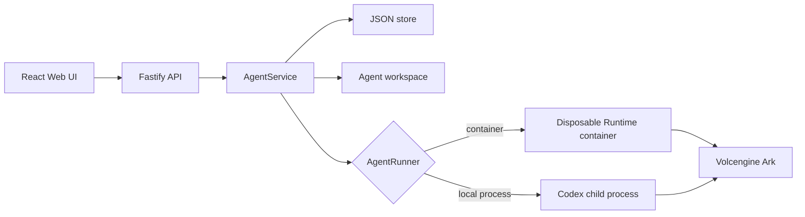

# Architecture

## Control Plane

The React client lists and configures agents, posts prompts, and polls a run
until it finishes. The AgentGuard floating window has a **Trace** tab (flat
timeline of the active run) and a **Runs** tab (global run list; selecting a
row loads that run's trace). Web `TraceEvent`, `SpanNode`, and `RunListItem` types match
the API contract. The client duplicates `buildSpanTree` (intentional, not a
shared package) so filter chips can re-nest locally; `api.events` stays the
live-trace fetch, while `api.listRuns` and `api.spanTree` wrap the run-list and
`tree=true` endpoints. The Fastify API validates request bodies, applies optional
bearer-token protection to API routes, and serves the built client in
production. [Web client](../apps/web/src/App.tsx) | [Web types](../apps/web/src/types.ts) | [Web span tree](../apps/web/src/span-tree.ts) | [API client](../apps/web/src/api.ts) | [API routes](../apps/server/src/app.ts)

`AgentService` owns lifecycle coordination and AgentGuard middleware (trace,
detect, recover, proactive budget, HITL). It accepts one active run per agent, writes
metadata through `JsonStore`, delegates workspace lifecycle to
`WorkspaceManager`, and delegates execution to an `AgentRunner` implementation.
[Service](../apps/server/src/agent-service.ts) | [Runner factory](../apps/server/src/runner-factory.ts) | [AgentGuard wiki](agentguard.md) | [Architecture one-pager](../docs/agentguard-architecture.md)

## Run Flow

1. The client posts a message for an agent.
2. The service persists the user message and queued run atomically, then marks
   the agent busy.
3. The service invokes the configured runner with the workspace path and any
   stored Codex thread ID.
4. On completion, it persists output, usage, the assistant message, the next
   thread ID, and the ready state. Failures store an error state; cancellation
   returns the agent to ready unless it was stopped.

Sources: [Service implementation](../apps/server/src/agent-service.ts) | [Domain types](../apps/server/src/types.ts)
